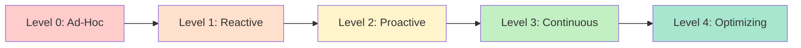
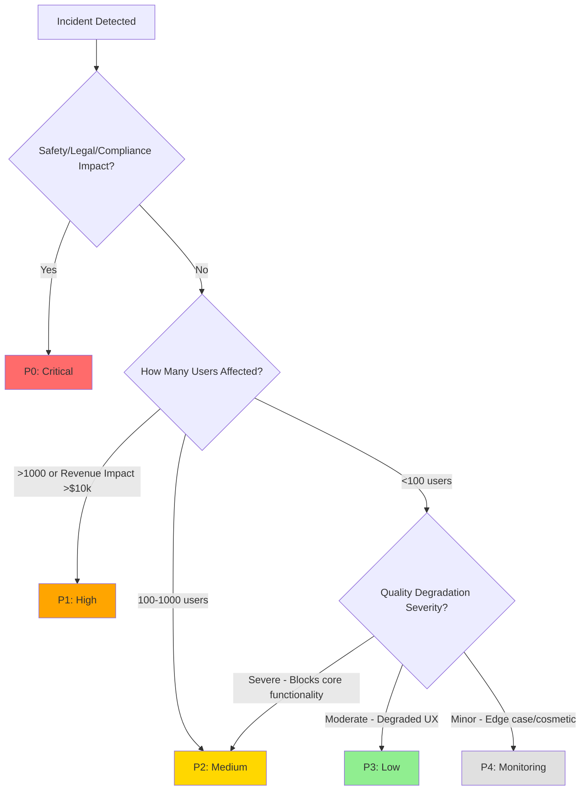

# AI Evals Course: Decision Frameworks & Templates

This document provides ready-to-use frameworks and templates for making key evaluation decisions throughout the AI product lifecycle.

---

## Framework 1: Evaluation Maturity Assessment

### Purpose
Assess your organization's current evaluation capabilities and identify gaps to address.

### The 5-Level Maturity Model



---

### Level 0: Ad-Hoc (No Systematic Evaluation)

**Characteristics:**
- ✅ Manual spot-checking by developers
- ✅ No reference dataset
- ✅ "Looks good to me" deployment decisions
- ✅ Reactive to user complaints only
- ✅ No measurement infrastructure

**Typical Team:**
- Small (<5 people)
- Early prototype phase
- Limited AI experience

**Tools:**
- Spreadsheets for manual review
- Print statements for debugging
- Slack for ad-hoc testing requests

**Risks:**
- ⚠️ High probability of production incidents
- ⚠️ No visibility into quality trends
- ⚠️ Can't reproduce or explain failures

**Next Steps to Level 1:**
1. Create first reference dataset (10-20 examples)
2. Set up basic logging (save inputs/outputs)
3. Define 1-2 critical metrics

**Time to Next Level:** 2-4 weeks

---

### Level 1: Reactive (Basic Systematic Evaluation)

**Characteristics:**
- ✅ Reference dataset exists (50-100 examples)
- ✅ Pre-deployment testing on reference set
- ✅ Basic logging in production
- ✅ Post-incident reviews
- ⚠️ No proactive monitoring

**Typical Team:**
- 5-10 people
- First production deployment
- 1-2 ML engineers

**Tools:**
- Reference dataset (CSV/JSON)
- Simple evaluation scripts
- Cloud logging (CloudWatch, Datadog)
- Manual review dashboards

**Capabilities:**
- Can validate changes before deployment
- Can investigate issues after they occur
- Can track basic metrics (latency, error rate)

**Risks:**
- ⚠️ Only discover issues after user impact
- ⚠️ Manual review doesn't scale
- ⚠️ Slow incident response

**Next Steps to Level 2:**
1. Implement 2-3 code-based guardrails
2. Set up automated evaluation runs (CI/CD)
3. Create alert system for critical metrics

**Time to Next Level:** 1-2 months

---

### Level 2: Proactive (Automated Pre-Deployment Validation)

**Characteristics:**
- ✅ Evaluation runs automatically in CI/CD
- ✅ Multiple evaluation metrics (code + LLM judges)
- ✅ Blocking tests prevent bad deployments
- ✅ Reference dataset regularly updated (200+ examples)
- ⚠️ Production monitoring still limited

**Typical Team:**
- 10-20 people
- Multiple production AI features
- Dedicated ML/platform engineers

**Tools:**
- Evaluation platform (Langfuse, Weave)
- CI/CD integration (GitHub Actions)
- Code-based metric library
- LLM judge pipelines

**Capabilities:**
- Catch regressions before deployment
- Compare model/prompt changes systematically
- Reproduce evaluation results
- Maintain quality standards

**Risks:**
- ⚠️ Reference dataset may drift from production
- ⚠️ No real-time production quality tracking
- ⚠️ Offline metrics don't predict online behavior

**Next Steps to Level 3:**
1. Deploy online guardrails (safety, compliance)
2. Implement continuous production monitoring
3. Set up human-in-loop review process

**Time to Next Level:** 2-4 months

---

### Level 3: Continuous (Production Monitoring & Guardrails)

**Characteristics:**
- ✅ Real-time guardrails in production
- ✅ Continuous offline evaluation (daily batches)
- ✅ Alerting for quality degradation
- ✅ Incident response runbooks
- ✅ Human review sampling system

**Typical Team:**
- 20+ people
- Multiple AI products at scale
- On-call rotation for AI systems

**Tools:**
- Full-featured platform (Arize, Humanloop)
- Online guardrails infrastructure
- Production monitoring dashboards
- Incident management system

**Capabilities:**
- Detect and respond to issues in real-time
- Track quality trends over time
- Discover emerging patterns in production
- Maintain SLAs for AI systems

**Risks:**
- ⚠️ Metric fatigue (too many dashboards)
- ⚠️ Alert fatigue (too many false positives)
- ⚠️ Evaluation as overhead rather than value-add

**Next Steps to Level 4:**
1. Integrate A/B testing with evaluation
2. Automate improvement loops
3. Close discovery-to-deployment cycle

**Time to Next Level:** 6-12 months

---

### Level 4: Optimizing (Closed-Loop Improvement)

**Characteristics:**
- ✅ A/B testing integrated with evaluation
- ✅ Automated dataset expansion from production
- ✅ Evaluation insights trigger experiments
- ✅ Self-healing systems (auto-rollback)
- ✅ Predictive quality monitoring

**Typical Team:**
- Enterprise-scale
- AI as core product differentiator
- Dedicated AI platform team

**Tools:**
- Custom experimentation platform
- Automated data labeling pipelines
- Predictive analytics for quality
- Auto-remediation systems

**Capabilities:**
- Continuously improve without manual intervention
- Predict quality issues before they occur
- Optimize for business metrics (revenue, retention)
- Scale evaluation to millions of interactions

**Characteristics of Maturity:**
- Evaluation is product culture, not just process
- Quality insights drive strategic decisions
- Evaluation ROI is measured and optimized

---

## Maturity Self-Assessment Template

Use this worksheet to determine your current level:

### Assessment Questions

| Question | Level 0 | Level 1 | Level 2 | Level 3 | Level 4 |
|----------|---------|---------|---------|---------|---------|
| **Do you have a reference dataset?** | No | Yes (50-100) | Yes (200+), updated | Yes, continuously expanding | Yes, automated expansion |
| **Can you run evals before deployment?** | No | Manual | Automated in CI/CD | + Blocking tests | + A/B test integration |
| **Do you have online guardrails?** | No | No | No | Yes | Yes + auto-remediation |
| **Do you monitor production quality?** | No | Manual spot-checks | Basic dashboards | Real-time alerts | Predictive monitoring |
| **Can you explain failures?** | No | Sometimes | Usually | Always | + Root cause automation |
| **How long to deploy a fix?** | Days | Hours | Hours | Minutes | Seconds (auto) |
| **Do you A/B test AI changes?** | No | No | Sometimes | Yes | Yes, integrated |

**Scoring:**
- Count your highest level with all "Yes" answers
- That's your current maturity level

---

### Gap Analysis Template

**Current Level:** ________

**Target Level (6 months):** ________

**Gaps to Address:**

| Capability | Current State | Target State | Action Items | Owner | Timeline |
|------------|--------------|--------------|--------------|-------|----------|
| Reference Dataset | 20 examples | 200+ examples | 1. Collect production samples<br>2. Expand edge cases<br>3. Set up refresh process | [Name] | [Date] |
| Evaluation Automation | Manual scripts | CI/CD integration | 1. Choose platform<br>2. Write CI/CD config<br>3. Set blocking thresholds | [Name] | [Date] |
| Production Monitoring | None | Real-time dashboards | 1. Deploy guardrails<br>2. Set up alerts<br>3. Create runbooks | [Name] | [Date] |
| ... | ... | ... | ... | ... | ... |

---

## Framework 2: Metric ROI Calculator

### Purpose
Decide which evaluation metrics to invest in based on expected return on investment.

### ROI Calculation Formula

```
ROI = (Value Generated - Implementation Cost - Runtime Cost) / Total Cost

Where:
- Value Generated = Issues Prevented × Cost per Issue
- Implementation Cost = Engineering Time × Hourly Rate
- Runtime Cost = (Monthly Cost × 12) for annual ROI
- Total Cost = Implementation + Annual Runtime
```

---

### ROI Calculator Template

#### Metric: [Metric Name]

**1. Implementation Costs**

| Cost Component | Estimate | Notes |
|----------------|----------|-------|
| Engineering Time (hours) | ____ | Design + implementation + testing |
| Hourly Rate | $____ | Avg engineer rate |
| **Implementation Cost** | **$____** | Time × Rate |
| Platform/Tool Setup | $____ | One-time fees |
| **Total Implementation** | **$____** |  |

**2. Runtime Costs**

| Cost Component | Monthly | Annual | Notes |
|----------------|---------|--------|-------|
| LLM API Calls | $____ | $____ | If using LLM judge |
| Compute/Infrastructure | $____ | $____ | Servers, databases |
| Human Review Time | $____ | $____ | Sampling, calibration |
| **Total Runtime** | **$____** | **$____** |  |

**3. Value Generated**

| Value Component | Estimate | Notes |
|-----------------|----------|-------|
| Issues Prevented (per month) | ____ | Based on historical data or estimate |
| Cost per Issue | $____ | User churn, support costs, liability |
| **Monthly Value** | **$____** | Issues × Cost |
| **Annual Value** | **$____** | Monthly × 12 |

**4. ROI Calculation**

```
Total Cost (Year 1) = Implementation + Annual Runtime
                    = $____ + $____
                    = $____

Annual Value = $____

Net Value (Year 1) = Annual Value - Total Cost
                   = $____ - $____
                   = $____

ROI (Year 1) = Net Value / Total Cost
             = $____ / $____
             = ____% 

Break-Even Month = Implementation Cost / (Monthly Value - Monthly Runtime)
                 = $____ / ($____ - $____)
                 = ____ months
```

**5. Decision**

| ROI Range | Recommendation |
|-----------|---------------|
| > 300% | 🟢 **High Priority** - Implement immediately |
| 100-300% | 🟡 **Good Investment** - Schedule within quarter |
| 0-100% | 🟠 **Marginal** - Consider if strategic value beyond ROI |
| < 0% | 🔴 **Skip or Redesign** - Costs exceed benefits |

**Your ROI:** ____%  
**Decision:** ____________

---

### Example: LLM Judge for Customer Support Tone

**1. Implementation Costs**

| Cost Component | Estimate | Notes |
|----------------|----------|-------|
| Engineering Time | 40 hours | Prompt design, calibration, integration |
| Hourly Rate | $150 | Senior ML engineer |
| Implementation Cost | $6,000 |  |
| Platform Setup | $0 | Using existing Langfuse |
| **Total Implementation** | **$6,000** |  |

**2. Runtime Costs**

| Cost Component | Monthly | Annual | Notes |
|----------------|---------|--------|-------|
| LLM API Calls | $800 | $9,600 | 10k conversations × $0.08/eval |
| Compute | $100 | $1,200 | Processing/storage |
| Human Review | $400 | $4,800 | 4 hrs/month calibration checks |
| **Total Runtime** | **$1,300** | **$15,600** |  |

**3. Value Generated**

| Value Component | Estimate | Notes |
|-----------------|----------|-------|
| Tone Issues Prevented | 50/month | Estimated 5% of conversations |
| Cost per Issue | $75 | Customer churn + support escalation |
| **Monthly Value** | **$3,750** |  |
| **Annual Value** | **$45,000** |  |

**4. ROI Calculation**

```
Total Cost (Year 1) = $6,000 + $15,600 = $21,600
Annual Value = $45,000
Net Value = $45,000 - $21,600 = $23,400
ROI = $23,400 / $21,600 = 108%
Break-Even = $6,000 / ($3,750 - $1,300) = 2.4 months
```

**Decision:** 🟡 **Good Investment** - Positive ROI, breaks even in Q1

---

### Quick ROI Estimation Table

For rapid decision-making, use these typical ranges:

| Metric Type | Implementation | Runtime (Monthly) | Typical ROI | Best For |
|-------------|---------------|-------------------|-------------|----------|
| **Code-Based (Simple)** | $2k-5k | $50-200 | 500%+ | High-volume, objective checks |
| **Code-Based (Complex)** | $5k-15k | $200-500 | 200-400% | Multi-step validation |
| **LLM Judge (Basic)** | $5k-10k | $500-2k | 100-300% | Subjective quality, medium volume |
| **LLM Judge (Calibrated)** | $15k-30k | $1k-5k | 50-200% | High-stakes subjective quality |
| **Human Review (Sample)** | $3k-8k | $2k-10k | 100-400% | Critical quality, low volume |
| **Human Review (Comprehensive)** | $10k-20k | $10k-50k | 0-100% | Highest stakes only |

---

## Framework 3: Incident Severity & Response Matrix

### Purpose
Standardize how your team assesses and responds to AI system incidents.

### Severity Rubric



---

### P0: Critical Severity

**Definition:**
Issues that pose immediate safety, legal, compliance, or severe reputational risk.

**Examples:**
- ✅ Healthcare AI providing dangerous medical advice
- ✅ Financial AI violating regulatory requirements
- ✅ PII (personally identifiable information) leakage
- ✅ Safety filter bypass allowing harmful content
- ✅ AI making unauthorized financial transactions
- ✅ Discriminatory outputs violating anti-bias policies

**Response SLA:**
- **Detection to Acknowledgment:** <15 minutes
- **Acknowledgment to Mitigation:** <30 minutes
- **Mitigation to Root Cause:** <4 hours
- **Post-Mortem:** Within 48 hours

**Response Actions:**

| Time | Action | Owner | Approval Needed |
|------|--------|-------|-----------------|
| 0-15 min | Page on-call engineer | Automated | None |
| 0-15 min | Notify executive team | On-call | None |
| 15-30 min | **Execute mitigation** (see options below) | On-call + Lead | CTO/VP Eng |
| 30 min-4 hr | Root cause analysis | Incident team | None |
| 4-48 hr | Implement permanent fix | Engineering | Engineering Lead |
| 48 hr | Post-mortem meeting | All stakeholders | None |

**Mitigation Options:**

1. **Full Rollback**
   - Revert to previous system version
   - Use when: Issue affects >50% of traffic

2. **Feature Kill Switch**
   - Disable AI component, fallback to manual/rule-based
   - Use when: AI is optional feature

3. **Traffic Routing**
   - Route all traffic to human agents
   - Use when: High-stakes domain (healthcare, legal)

4. **Input Blocking**
   - Block specific input patterns triggering issue
   - Use when: Issue isolated to specific cases

**Communication Template:**

```
SUBJECT: [P0] AI System Incident - [Brief Description]

DETECTED: [Time]
IMPACT: [Number of users / $ amount / compliance violation]
STATUS: [Investigating / Mitigated / Resolved]

SUMMARY:
[2-3 sentence description of what happened]

IMMEDIATE ACTION TAKEN:
- [Mitigation action]
- [Current system state]

NEXT STEPS:
- [Root cause investigation ETA]
- [Permanent fix ETA]

CUSTOMER IMPACT:
[What users experienced, duration]

STAKEHOLDERS NOTIFIED:
- [Names, titles]
```

---

### P1: High Severity

**Definition:**
Significant user impact or revenue loss, but no immediate safety/legal risk.

**Examples:**
- ✅ AI system outage affecting >1,000 users
- ✅ 50%+ degradation in quality metrics
- ✅ Revenue loss >$10k/day
- ✅ Core functionality broken
- ✅ Viral negative user feedback

**Response SLA:**
- **Detection to Acknowledgment:** <1 hour
- **Acknowledgment to Mitigation:** <4 hours
- **Mitigation to Root Cause:** <24 hours
- **Post-Mortem:** Within 1 week

**Response Actions:**

| Time | Action | Owner | Communication |
|------|--------|-------|---------------|
| 0-1 hr | Acknowledge incident | On-call | Slack alert to eng team |
| 1-4 hr | Implement mitigation | Engineering Lead | Status update to stakeholders |
| 4-24 hr | Root cause analysis | Incident team | Detailed incident report |
| 1 week | Deploy permanent fix | Engineering | Customer communication if needed |

**Mitigation Options:**

1. **Traffic Throttling**
   - Reduce to 10-25% of traffic
   - Monitor for quality improvement

2. **Rate Limiting**
   - Limit AI calls per user
   - Prevent system overload

3. **Model Swap**
   - Switch to more reliable (but possibly less capable) model
   - Temporary quality/cost tradeoff

4. **Feature Degradation**
   - Disable advanced features, keep core functionality
   - Example: Disable personalization, use default recommendations

---

### P2: Medium Severity

**Definition:**
Quality degradation affecting minority of users, non-critical functionality.

**Examples:**
- ✅ Tone issues in specific user segments
- ✅ 10-20% drop in conversion rate
- ✅ Edge case failures (100-1,000 users)
- ✅ Non-blocking bugs in AI outputs
- ✅ Latency increase (500ms → 2s)

**Response SLA:**
- **Detection to Acknowledgment:** <4 hours (business hours)
- **Acknowledgment to Fix:** <1 week
- **Post-Mortem:** Optional (if pattern emerges)

**Response Actions:**

1. **Increase Monitoring**
   - Sample rate 10% → 50%
   - Daily review meetings

2. **Create Priority Ticket**
   - Schedule for next sprint
   - Assign to relevant team

3. **Notify Stakeholders**
   - Async communication (email/Slack)
   - No executive escalation

---

### P3: Low Severity

**Definition:**
Cosmetic issues, rare edge cases, minimal user impact.

**Examples:**
- ✅ Minor formatting glitches
- ✅ Typos in AI outputs
- ✅ Edge cases affecting <100 users
- ✅ Non-critical feature failures

**Response SLA:**
- **Backlog ticket:** Next sprint planning
- **No immediate action required**

---

### P4: Monitoring Only

**Definition:**
Potential issues flagged by monitoring but no confirmed user impact.

**Examples:**
- ✅ Metric trending down but still in acceptable range
- ✅ Anomalies in low-traffic segments
- ✅ New pattern detected, unclear if problematic

**Response:**
- **Log for analysis**
- **Review in weekly metrics meeting**
- **Escalate if pattern continues**

---

## Incident Response Checklist Template

Use this checklist for every incident (P0-P2):

### Immediate Response (First Hour)

- [ ] **Severity assessed** (P0/P1/P2/P3)
- [ ] **Incident lead assigned**
- [ ] **War room created** (Slack channel / Zoom)
- [ ] **Stakeholders notified** (per severity matrix)
- [ ] **Logging/monitoring increased** (capture evidence)

### Investigation (Hours 1-4)

- [ ] **Reproduction confirmed** (can we reproduce the issue?)
- [ ] **Scope quantified** (how many users? revenue impact?)
- [ ] **Timeline established** (when did it start?)
- [ ] **Hypothesis documented** (what do we think caused it?)

### Mitigation (Hours 4-24)

- [ ] **Mitigation strategy selected** (rollback, throttle, disable, etc.)
- [ ] **Mitigation implemented**
- [ ] **Mitigation validated** (is issue resolved?)
- [ ] **Customers notified** (if externally visible)

### Root Cause Analysis (Within 48 hours for P0, 1 week for P1)

- [ ] **Root cause identified**
- [ ] **Contributing factors documented**
- [ ] **Why it wasn't caught pre-deployment** (evaluation gap?)

### Remediation

- [ ] **Permanent fix implemented**
- [ ] **Regression test added** (to reference dataset)
- [ ] **Evaluation metric added/updated** (prevent recurrence)
- [ ] **Runbook updated** (for faster response next time)

### Post-Mortem (P0/P1 required, P2 optional)

- [ ] **Post-mortem doc written** (use template below)
- [ ] **Post-mortem meeting held**
- [ ] **Action items assigned** (with owners and deadlines)
- [ ] **Follow-up scheduled** (verify actions completed)

---

## Post-Mortem Template

```markdown
# Post-Mortem: [Incident Title]

**Date:** [Incident Date]
**Severity:** [P0/P1/P2]
**Duration:** [Start time - End time]
**Impact:** [Users affected, revenue lost, compliance breach, etc.]

## Summary
[2-3 sentence overview of what happened]

## Timeline

| Time | Event |
|------|-------|
| [HH:MM] | [First indication of issue] |
| [HH:MM] | [Issue detected by monitoring/user report] |
| [HH:MM] | [Incident declared] |
| [HH:MM] | [Mitigation implemented] |
| [HH:MM] | [Issue resolved] |
| [HH:MM] | [Permanent fix deployed] |

## Root Cause

### What Happened
[Technical explanation of the issue]

### Why It Happened
[Root cause analysis - be specific]

### Why It Wasn't Caught Earlier
[Evaluation gap analysis]

## Impact

### User Impact
- [Number of users affected]
- [User experience degradation]
- [Duration of impact]

### Business Impact
- [Revenue loss: $X]
- [Support tickets: Y]
- [Reputational damage: qualitative assessment]

### Compliance Impact
- [Regulatory violations, if any]
- [Legal exposure]

## Response Evaluation

### What Went Well ✅
- [Positive aspects of response]

### What Went Poorly ❌
- [Issues in detection, mitigation, or communication]

## Action Items

| Action | Owner | Deadline | Status |
|--------|-------|----------|--------|
| [Specific, actionable task] | [Name] | [Date] | [ ] |
| [Add to reference dataset] | [Name] | [Date] | [ ] |
| [Create new evaluation metric] | [Name] | [Date] | [ ] |
| [Update runbook] | [Name] | [Date] | [ ] |

## Lessons Learned

### Technical
- [What we learned about the system]

### Process
- [What we learned about our processes]

### Evaluation
- [Gaps in evaluation that allowed this to happen]
- [New metrics or monitoring needed]
```

---

## Severity Decision Tree Worksheet

Use this to practice severity assessment:

### Scenario 1
**Issue:** AI chatbot occasionally uses informal tone with enterprise customers  
**Affected Users:** ~50/day  
**Business Impact:** Minor dissatisfaction, no escalations  
**Safety/Legal:** None  

**Your Assessment:** P____  
**Recommended Response:** _______________

<details>
<summary>Answer</summary>
**Severity:** P3 (Low)  
**Response:** Backlog ticket, fix in next sprint. Add tone evaluation metric if pattern continues.
</details>

---

### Scenario 2
**Issue:** Recommendation engine down, users see error message  
**Affected Users:** 5,000+ (all users in affected region)  
**Business Impact:** No revenue generation from recommendations (~$2k/hour)  
**Safety/Legal:** None  

**Your Assessment:** P____  
**Recommended Response:** _______________

<details>
<summary>Answer</summary>
**Severity:** P1 (High)  
**Response:** <4 hour mitigation (rollback or traffic routing), root cause within 24 hours.
</details>

---

### Scenario 3
**Issue:** Healthcare triage AI recommended "wait and see" for symptoms that turned out to be heart attack  
**Affected Users:** 1  
**Business Impact:** Potential lawsuit, patient harm  
**Safety/Legal:** Life-threatening incident, liability  

**Your Assessment:** P____  
**Recommended Response:** _______________

<details>
<summary>Answer</summary>
**Severity:** P0 (Critical)  
**Response:** Immediate rollback/kill switch (<30 min), exec notification, legal consultation, root cause <4 hours.
</details>

---

## Using These Frameworks

### When to Use Maturity Assessment
- **Quarterly:** Track progress over time
- **New Project Start:** Establish baseline
- **Executive Review:** Communicate current state and needs

### When to Use ROI Calculator
- **Metric Prioritization:** Deciding which metrics to build
- **Budget Planning:** Justifying eval infrastructure investment
- **Platform Selection:** Build vs buy decisions

### When to Use Incident Matrix
- **Real-Time:** During active incidents
- **Training:** Onboarding new team members
- **Planning:** Creating incident response playbooks

---

These frameworks transform abstract evaluation concepts into concrete, actionable decisions for your team.
