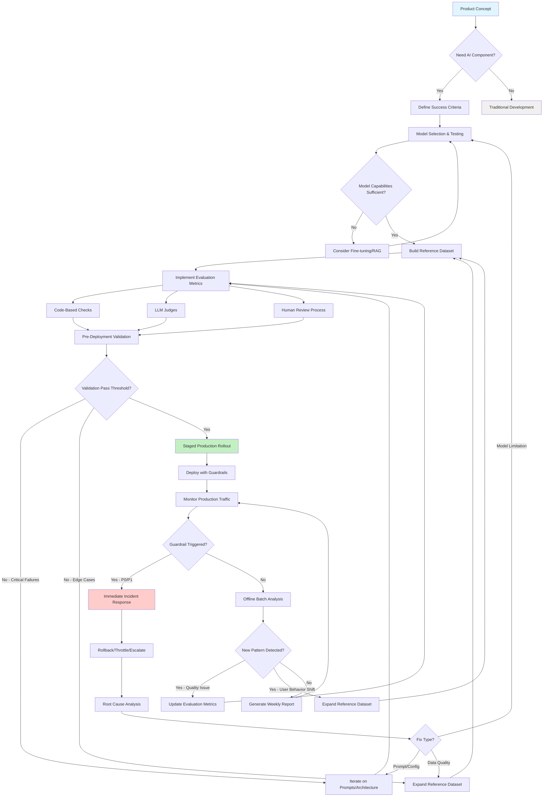
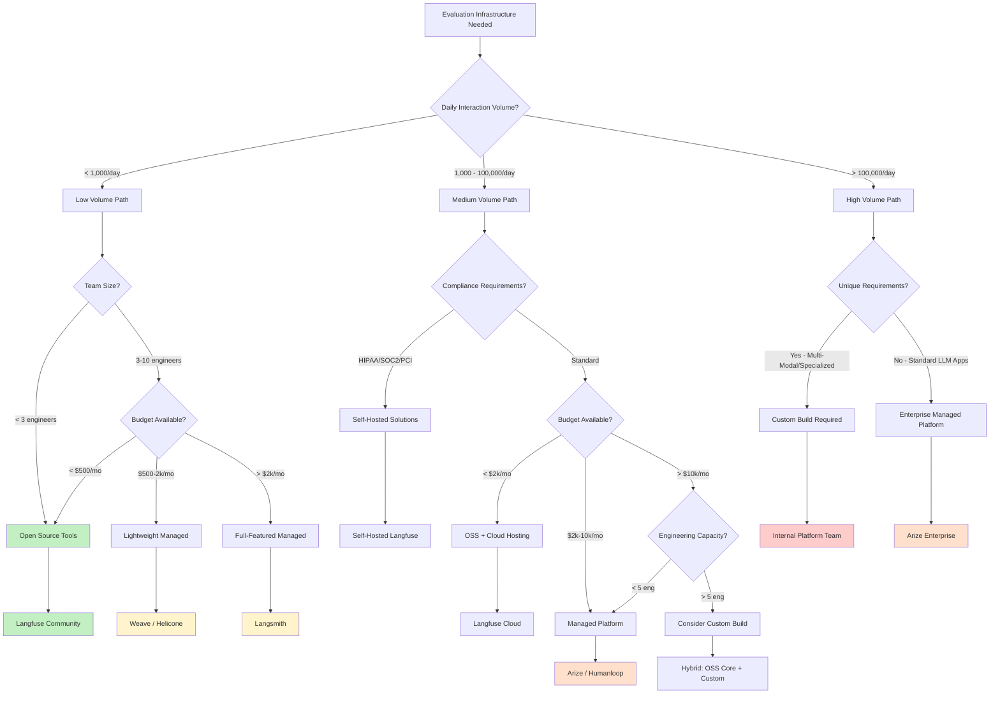
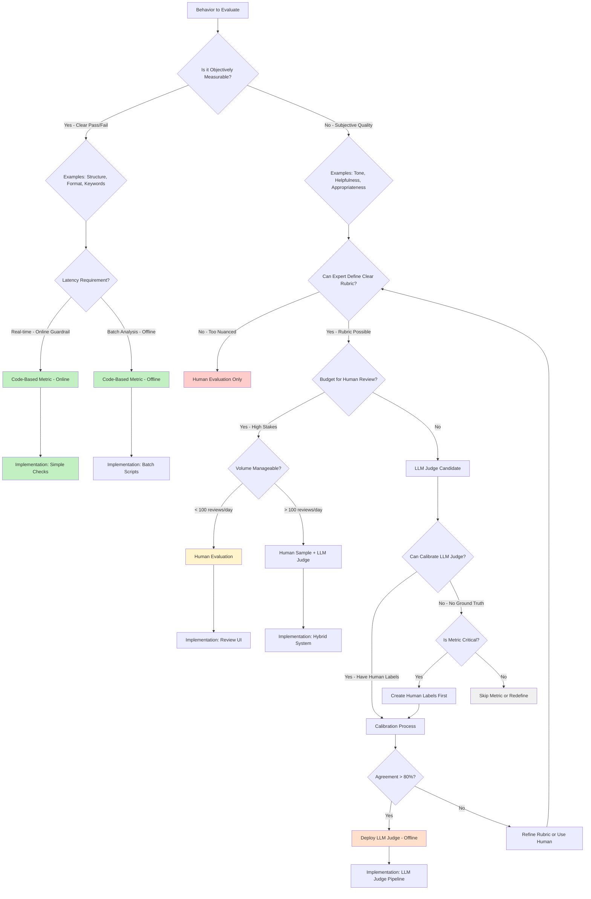
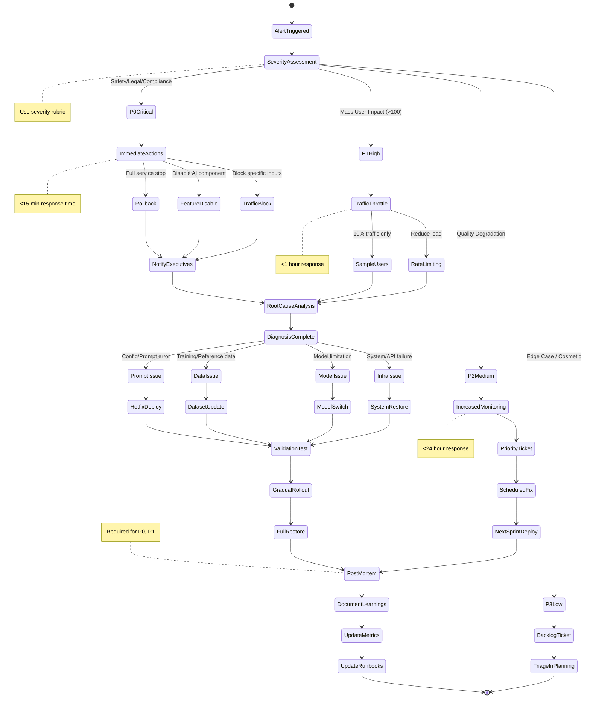
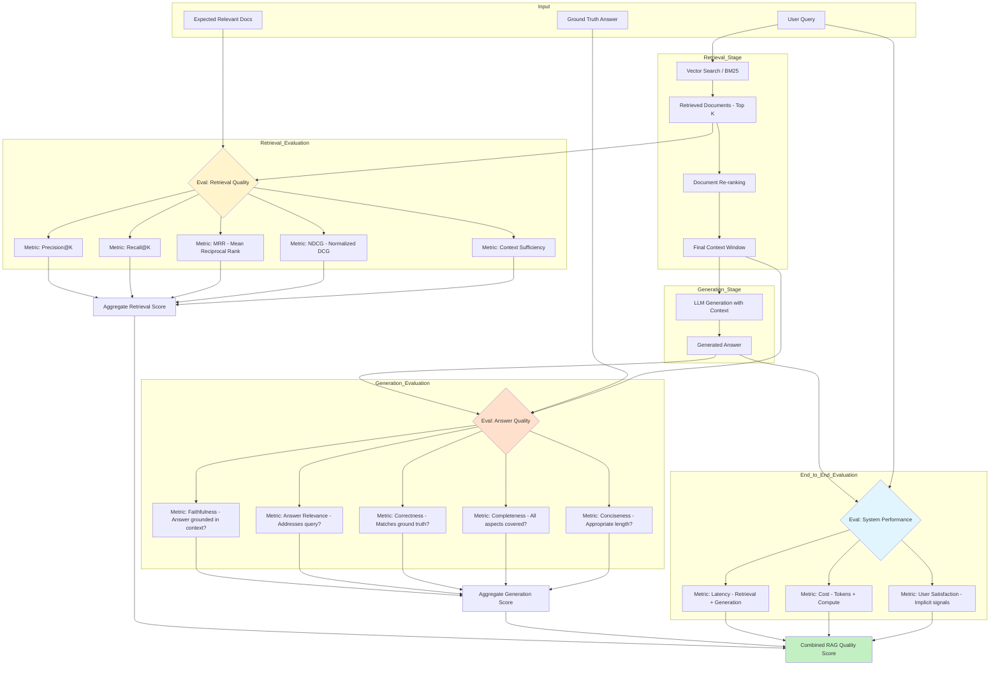
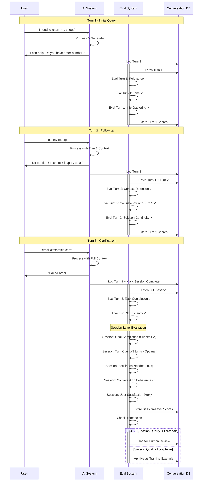

# AI Evals Course: Visual Decision Flowcharts

This document contains the key decision flowcharts and process diagrams that enhance the AI Evals for Everyone course with practical, visual guidance for building production AI systems.

---

## 1. End-to-End Evaluation Lifecycle

This flowchart shows the complete journey from product concept through production monitoring and continuous improvement.

**Key Decision Points:**
- **Need AI Component?** - Not every problem requires AI; consider rule-based alternatives
- **Model Capabilities Sufficient?** - Benchmark performance vs. your reference dataset
- **Validation Pass Threshold?** - Define acceptable failure rates before deployment
- **Fix Type?** - Different root causes require different remediation paths

---

## 2. Build vs Buy Decision Tree for Evaluation Infrastructure

This flowchart helps teams decide whether to use open-source tools, managed platforms, or build custom evaluation infrastructure.

**Decision Criteria Summary:**

| Volume | Team | Budget | Compliance | Recommendation |
|--------|------|--------|------------|----------------|
| Low | Small | Minimal | No | OSS (Langfuse Community) |
| Low | Small | <$2k | No | Managed Lite (Weave) |
| Medium | Medium | <$2k | No | OSS + Cloud |
| Medium | Medium | $2-10k | No | Managed (Arize/Humanloop) |
| Medium | Any | Any | Yes | Self-Hosted OSS |
| High | Large | >$10k | No | Enterprise Managed |
| High | Large | >$10k | Unique needs | Custom Build |

---

## 3. Metric Selection Decision Flow

This flowchart guides the decision of whether to use code-based metrics, LLM judges, or human evaluation for specific behaviors.

**Cost-Benefit Analysis:**

| Approach | Setup Cost | Runtime Cost | Latency | Best For |
|----------|-----------|--------------|---------|----------|
| Code-Based | Low ($) | Very Low | <10ms | Structure, compliance, keywords |
| LLM Judge | Medium ($$) | Medium-High | 500ms-2s | Tone, relevance, quality (offline) |
| Human | Low ($) | High ($$$) | Minutes-Days | Nuanced judgment, calibration |

---

## 4. Incident Response Workflow

This state diagram shows the complete incident response process when evaluation guardrails trigger or quality issues are detected.

**Severity Definitions:**

| Priority | Definition | Response SLA | Notification | Examples |
|----------|-----------|--------------|--------------|----------|
| **P0** | Safety, legal, or compliance violation | <15 min | Page on-call + exec | Medical misinfo, PII leak, illegal advice |
| **P1** | Severe user impact affecting >100 users | <1 hour | Team lead + PM | Service outage, mass incorrect responses |
| **P2** | Quality degradation affecting <100 users | <24 hours | Async notification | Tone issues in subset, edge case failures |
| **P3** | Cosmetic or rare edge cases | Next sprint | Backlog ticket | Format glitches, minor typos |

---

## 5. RAG System Evaluation Pipeline

This diagram shows the complete evaluation flow for Retrieval-Augmented Generation systems, covering both retrieval and generation quality.

**RAG-Specific Metrics Explained:**

**Retrieval Metrics:**
- **Precision@K**: Of the K documents retrieved, how many are relevant?
  - Formula: `(Relevant Retrieved) / K`
  - Use when: You care about quality over quantity
  
- **Recall@K**: Of all relevant documents, how many did we retrieve?
  - Formula: `(Relevant Retrieved) / (Total Relevant)`
  - Use when: Completeness is critical
  
- **MRR (Mean Reciprocal Rank)**: How soon does the first relevant doc appear?
  - Formula: `1 / (Rank of First Relevant Doc)`
  - Use when: First result matters most
  
- **Context Sufficiency**: Does the context contain enough info to answer?
  - Requires: LLM judge or human evaluation
  - Critical for: Preventing hallucination

**Generation Metrics:**
- **Faithfulness**: Is the answer grounded in retrieved context?
  - Detects: Hallucination
  - Method: LLM judge comparing answer to context
  
- **Answer Relevance**: Does it address the user's query?
  - Detects: Off-topic responses
  - Method: Semantic similarity or LLM judge

---

## 6. Multi-Turn Conversation Evaluation Flow

This sequence diagram shows how to evaluate conversational AI systems across multiple interaction turns with both turn-level and session-level metrics.

**Multi-Turn Metrics Framework:**

| Metric Level | Metric Name | What It Measures | Evaluation Method |
|--------------|-------------|------------------|-------------------|
| **Turn-Level** | Relevance | Does response address current input? | LLM Judge |
| **Turn-Level** | Context Retention | Does it remember prior turns? | Code check for references |
| **Turn-Level** | Consistency | No contradictions with prior turns? | LLM Judge |
| **Turn-Level** | Tone Maintenance | Consistent personality/brand voice? | LLM Judge |
| **Session-Level** | Goal Completion | Did user achieve their objective? | Business logic + signals |
| **Session-Level** | Efficiency | Minimum turns to resolution? | Turn count |
| **Session-Level** | Escalation Timing | When did it hand off to human? | Code check |
| **Session-Level** | Coherence | Does full conversation make sense? | LLM Judge |
| **Session-Level** | User Satisfaction | Did user seem satisfied? | Implicit signals |

**Implicit Satisfaction Signals:**
- ✅ Conversation ended normally (not abandoned)
- ✅ No repeated rephrasing of same question
- ✅ No explicit frustration indicators
- ✅ User provided requested information
- ❌ Session abandoned mid-conversation
- ❌ User asked to speak to human
- ❌ Multiple "I don't understand" from user

---

## Usage Guide for These Flowcharts

### When to Use Each Flowchart:

1. **End-to-End Lifecycle** - Use during project planning to map your complete evaluation strategy
2. **Build vs Buy** - Use when evaluating evaluation platforms (meta!)
3. **Metric Selection** - Use when deciding how to implement each specific metric
4. **Incident Response** - Print and post for on-call engineers; use during drills
5. **RAG Evaluation** - Use when building or auditing RAG systems
6. **Multi-Turn Evaluation** - Use for conversational AI, chatbots, or agents

### Integration with Course Chapters:

- **Chapter 3** (Evaluation Framework) → Metric Selection Flow
- **Chapter 4** (Reference Datasets) → End-to-End Lifecycle (dataset creation loop)
- **Chapter 5** (Evaluation Metrics) → Metric Selection + RAG/Multi-Turn specific
- **Chapter 6** (Production Challenge) → Incident Response
- **Chapter 7** (Production Monitoring) → End-to-End Lifecycle (production section)
- **New Chapter 5.6** (Team & Infrastructure) → Build vs Buy

---

## Next Steps

These flowcharts should be:
1. **Printed** as posters for team rooms
2. **Embedded** in internal wikis and runbooks
3. **Referenced** during design reviews and post-mortems
4. **Updated** as your team learns and evolves practices

The diagrams are intentionally detailed to serve as both learning tools and operational references.
