# 🎯 AI Evals: Radar Charts & Visual Comparisons

> **Deep-dive visual analytics for AI evaluation strategies**

---

## 📊 Domain Comparison Radar Charts

### Healthcare AI System Profile

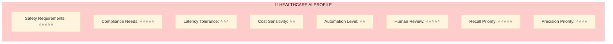

**Key Characteristics:**
- **Safety:** 🔴 Maximum - Life-critical decisions
- **Compliance:** 🔴 Maximum - HIPAA, medical regulations
- **Human Review:** 🔴 Maximum - 100% sampling for high-risk
- **Recall:** 🔴 Maximum - Cannot miss critical symptoms
- **Cost:** 🟢 Low concern - Patient safety > cost optimization

---

### E-Commerce AI System Profile

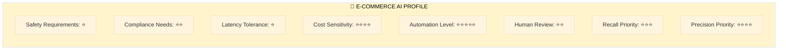

**Key Characteristics:**
- **Automation:** 🟢 Maximum - Scale to millions of users
- **Cost:** 🔴 High concern - Every penny counts at scale
- **Latency:** 🔴 Low tolerance - Page load speed critical
- **Precision:** 🟡 Important - Relevant recommendations drive conversion
- **Safety:** 🟢 Low - No life/death consequences

---

### Legal AI System Profile

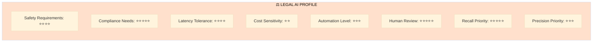

**Key Characteristics:**
- **Recall:** 🔴 Maximum - Cannot miss legal risks
- **Compliance:** 🔴 Maximum - Regulatory requirements
- **Human Review:** 🔴 Maximum - Attorney final decision always
- **Latency:** 🟢 High tolerance - Quality > speed
- **Precision:** 🟡 Moderate - False positives acceptable

---

### Customer Support AI System Profile

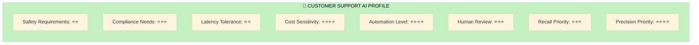

**Key Characteristics:**
- **Automation:** 🟡 High - Deflect 40%+ tickets
- **Cost:** 🟡 Important - Balance savings vs quality
- **Precision:** 🟡 Important - Accurate answers build trust
- **Latency:** 🟡 Moderate - Real-time but not instant
- **Cultural Fit:** 🔴 Critical (not shown in basic profile)

---

## 🎯 Metric Approach Comparison

### Code-Based Metrics Profile

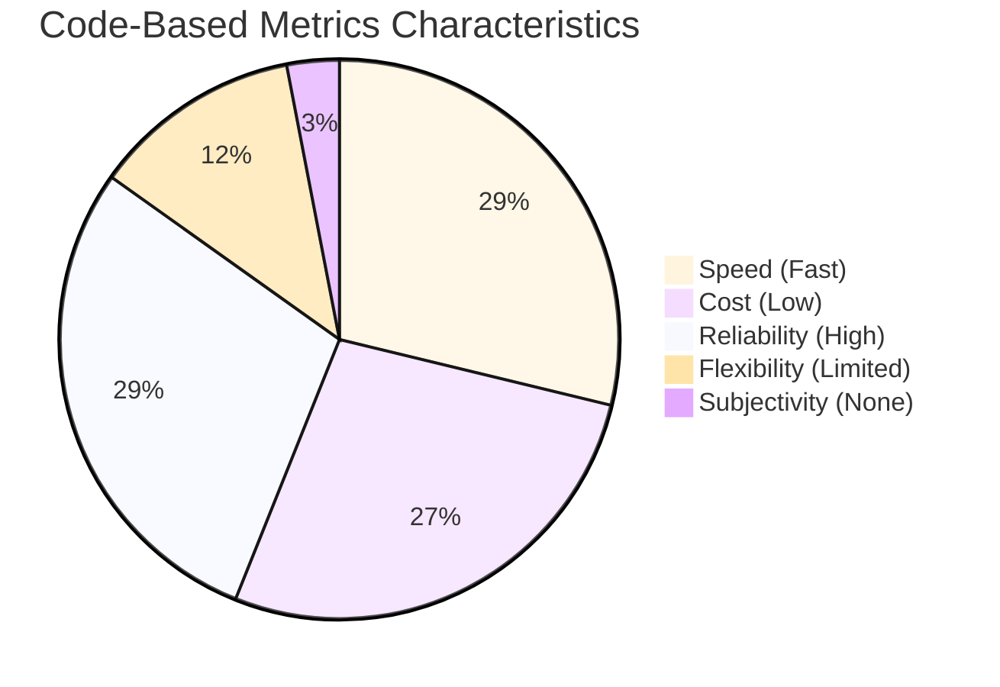

**Best For:**
- ✅ Format validation (JSON structure, required fields)
- ✅ Compliance checks (legal disclaimers present)
- ✅ Performance metrics (latency, token count)
- ✅ Simple content rules (keyword presence/absence)
- ❌ Subjective quality (tone, helpfulness)
- ❌ Contextual appropriateness

**Typical Use Cases:**
1. Safety filter (block harmful keywords)
2. PII detection (regex patterns)
3. Response length limits
4. Required disclaimer injection
5. Format/schema validation

---

### LLM Judge Metrics Profile

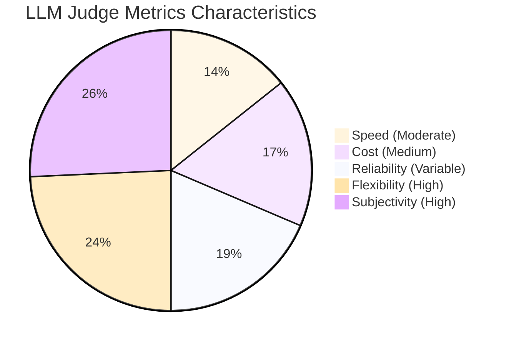

**Best For:**
- ✅ Subjective quality (tone, helpfulness, empathy)
- ✅ Contextual appropriateness
- ✅ Complex reasoning evaluation
- ✅ Multi-dimensional assessment
- ⚠️ Requires calibration (80%+ agreement with humans)
- ❌ Real-time guardrails (too slow)
- ❌ High-stakes final decisions

**Typical Use Cases:**
1. Customer service tone evaluation
2. Content relevance scoring
3. Explanation quality assessment
4. Conversation coherence
5. Cultural appropriateness

---

### Human Review Profile

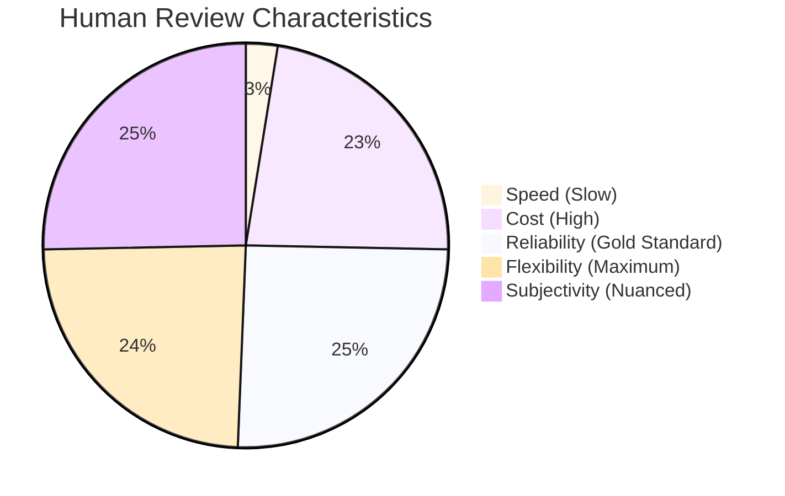

**Best For:**
- ✅ Gold standard / ground truth
- ✅ LLM judge calibration
- ✅ High-stakes decisions (legal, medical)
- ✅ Edge case investigation
- ✅ Metric validation
- ❌ High volume (>1000s/day)
- ❌ Real-time evaluation

**Typical Use Cases:**
1. Legal risk assessment (final decision)
2. Medical advice validation
3. LLM judge calibration dataset
4. Edge case analysis
5. Quarterly quality audits

---

## 📈 Maturity Level Deep Dives

### Level 0: Ad-Hoc

```mermaid
graph LR
    subgraph L0["Level 0: Ad-Hoc (🔴 High Risk)"]
        C1[Capabilities:<br/>Manual spot-checks]
        C2[Tools:<br/>Spreadsheets, print()]
        C3[Process:<br/>None]
        
        R1[Risks:<br/>Production incidents]
        R2[Costs:<br/>$0 investment]
        R3[ROI:<br/>-∞% <br/>Negative value]
    end
    
    C1 -.-> R1
    C2 -.-> R2
    C3 -.-> R3
    
    style L0 fill:#ffcccc
```

**Characteristics Breakdown:**
- **Team Size:** 1-5 people
- **Investment:** $0 formal evaluation
- **Incident Cost:** $100k-500k/year (unmitigated)
- **Time to Fix:** Days
- **Quality Confidence:** 😰 Very Low
- **Deployment Risk:** 🔥🔥🔥🔥🔥

---

### Level 1: Reactive

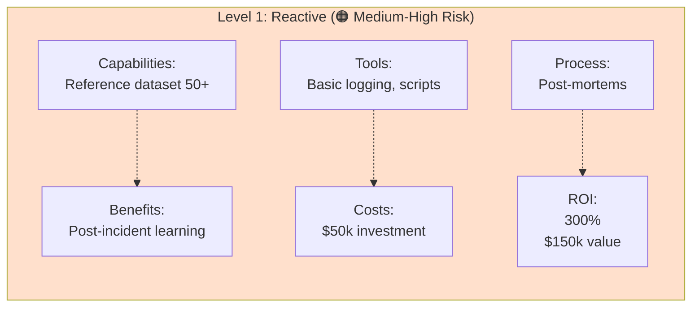

**Characteristics Breakdown:**
- **Team Size:** 5-10 people
- **Investment:** $50k (eng time + tools)
- **Prevented Incidents:** $200k/year
- **Time to Fix:** Hours
- **Quality Confidence:** 🙂 Moderate
- **Deployment Risk:** 🔥🔥🔥

---

### Level 2: Proactive

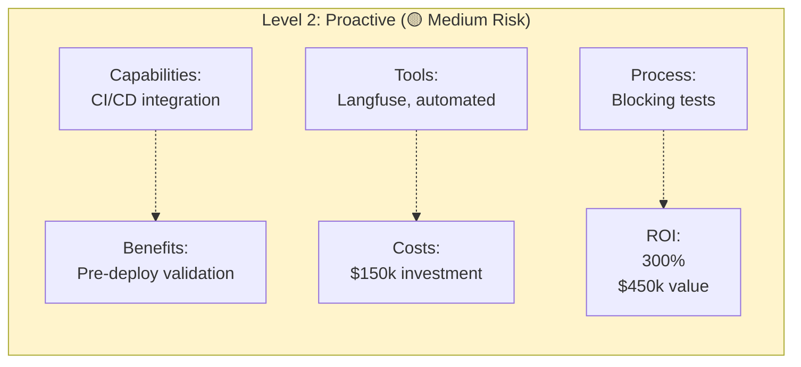

**Characteristics Breakdown:**
- **Team Size:** 10-20 people
- **Investment:** $150k (platform + eng)
- **Prevented Incidents:** $600k/year
- **Time to Fix:** Hours (with confidence)
- **Quality Confidence:** 😊 Good
- **Deployment Risk:** 🔥🔥

---

### Level 3: Continuous

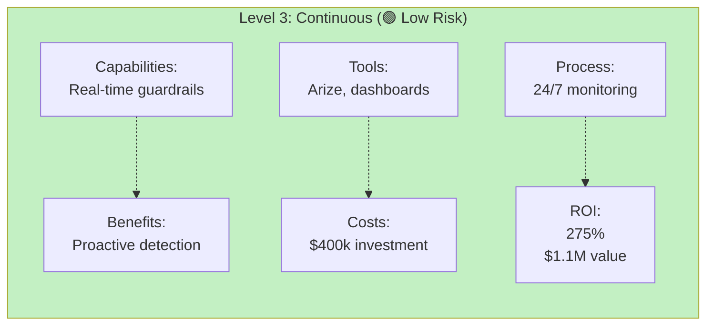

**Characteristics Breakdown:**
- **Team Size:** 20-50 people
- **Investment:** $400k (platform + team + infra)
- **Value Generated:** $1.5M/year (quality + speed)
- **Time to Fix:** Minutes
- **Quality Confidence:** 😃 Very Good
- **Deployment Risk:** 🔥

---

### Level 4: Optimizing

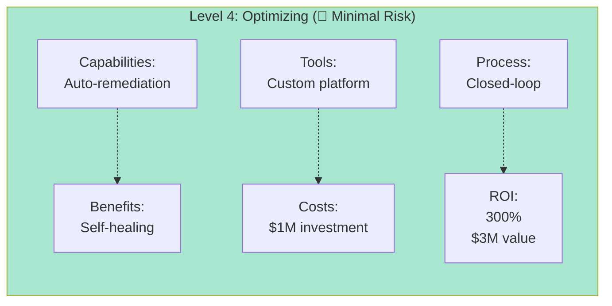

**Characteristics Breakdown:**
- **Team Size:** 50+ people (dedicated platform)
- **Investment:** $1M (custom platform)
- **Value Generated:** $4M/year (competitive advantage)
- **Time to Fix:** Seconds (automated)
- **Quality Confidence:** 🤩 Excellent
- **Deployment Risk:** ✨

---

## 💰 Investment vs Return Analysis

### Cost Structure by Maturity Level

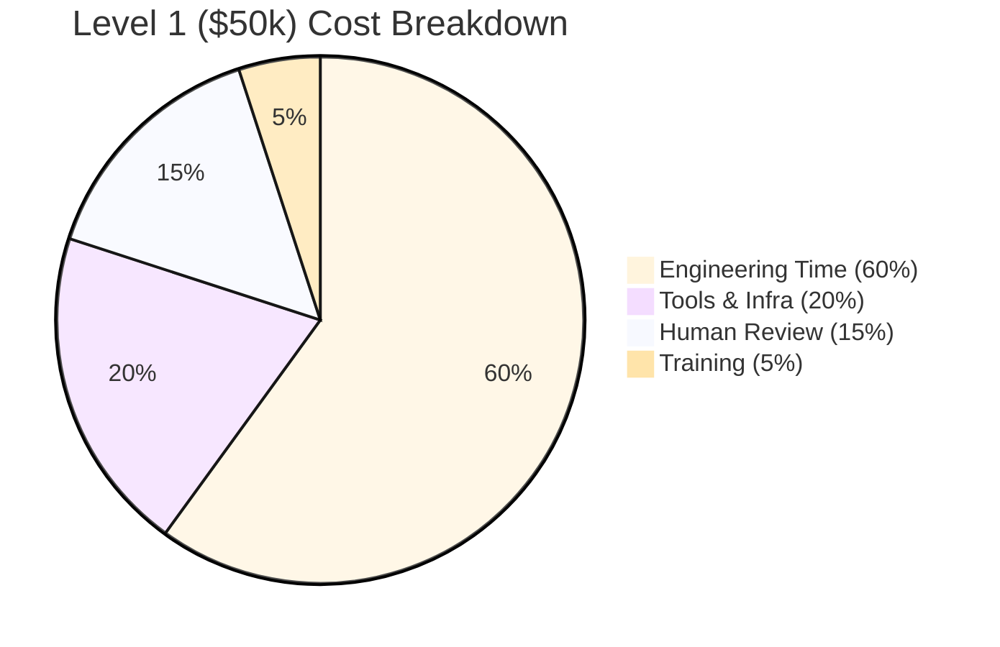

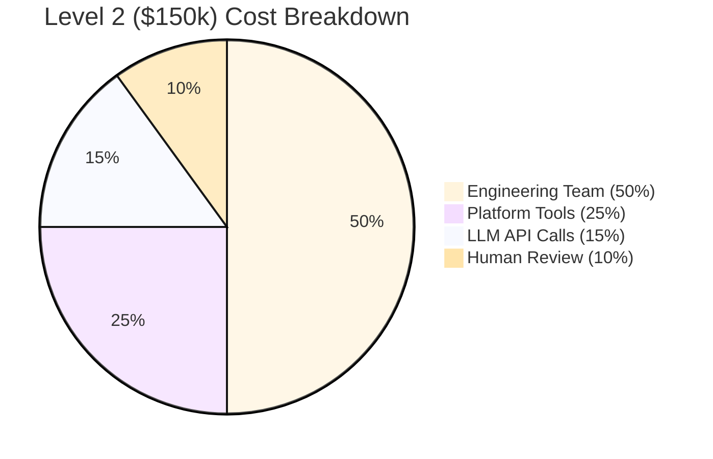

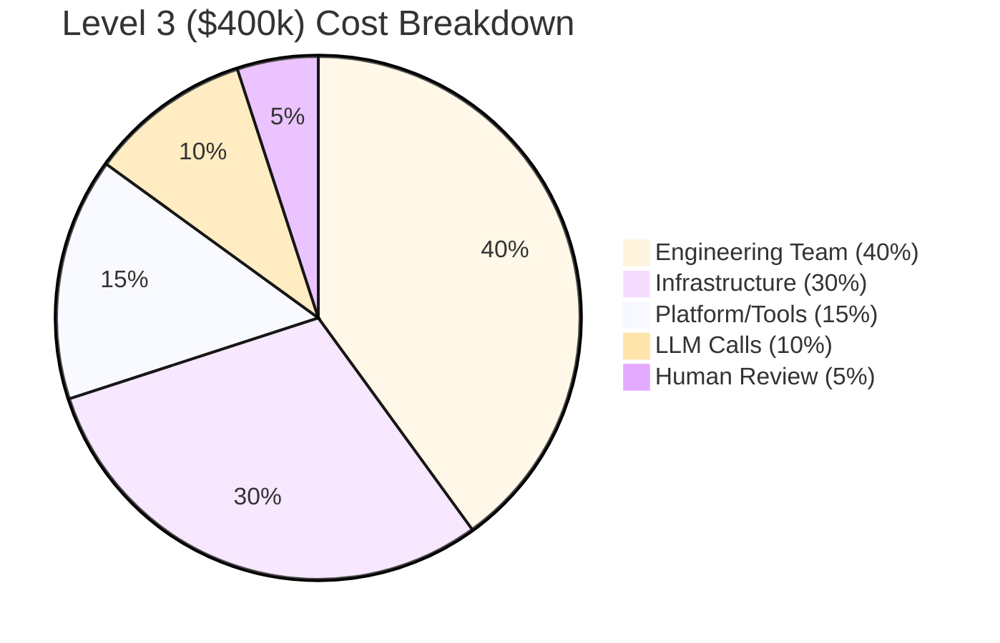

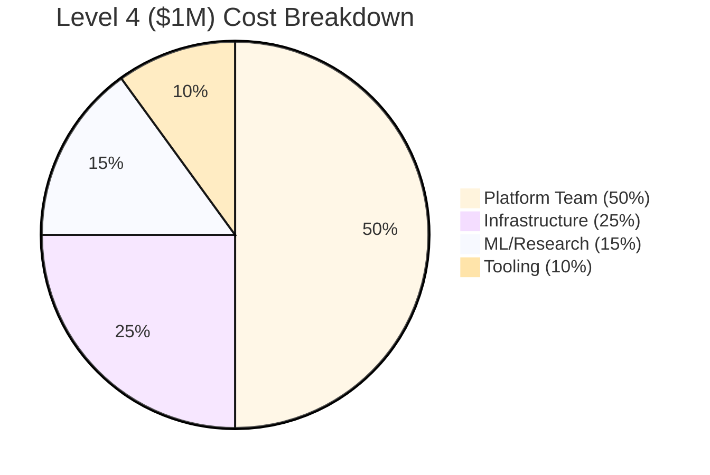

---

## 🎯 Metric Selection Matrix

### Decision Factors Heatmap

| Metric Type | Speed | Cost | Reliability | Flexibility | Real-time? |
|-------------|-------|------|-------------|-------------|------------|
| **Code-Based** | 🟢🟢🟢🟢🟢 | 🟢🟢🟢🟢🟢 | 🟢🟢🟢🟢🟢 | 🔴🔴 | ✅ Yes |
| **LLM Judge** | 🟡🟡🟡 | 🟡🟡🟡 | 🟡🟡🟡 | 🟢🟢🟢🟢 | ❌ No |
| **Human Review** | 🔴🔴 | 🔴🔴🔴🔴 | 🟢🟢🟢🟢🟢 | 🟢🟢🟢🟢🟢 | ❌ No |

**Selection Guide:**

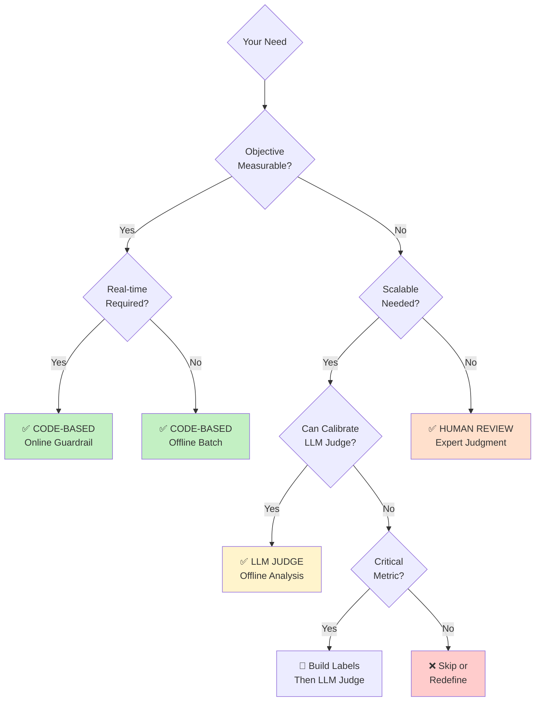

---

## 🌍 Cultural Evaluation Complexity

### Language-Region Matrix

| Language | Regions | Tone Variation | Formality | Cultural Load |
|----------|---------|----------------|-----------|---------------|
| 🇺🇸 **English** | US, UK, AU | Low | Medium | ⭐⭐ |
| 🇪🇸 **Spanish** | ES, MX, AR, CL | High | Variable | ⭐⭐⭐⭐ |
| 🇫🇷 **French** | FR, CA, BE | Medium | High | ⭐⭐⭐ |
| 🇩🇪 **German** | DE, AT, CH | Low | High | ⭐⭐⭐ |
| 🇨🇳 **Chinese** | CN, TW, HK | Very High | Very High | ⭐⭐⭐⭐⭐ |
| 🇯🇵 **Japanese** | JP | Low | Very High | ⭐⭐⭐⭐⭐ |
| 🇦🇪 **Arabic** | SA, AE, EG | Very High | High | ⭐⭐⭐⭐⭐ |

### Evaluation Effort by Cultural Complexity

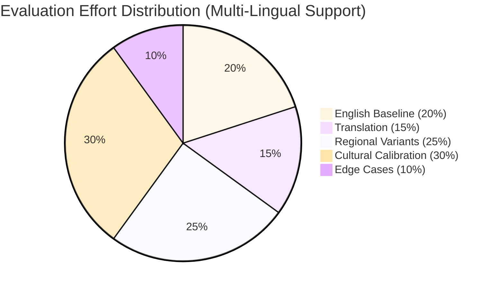

---

## 📊 Production Monitoring Dashboard

### Alert Severity Distribution (Healthy System)

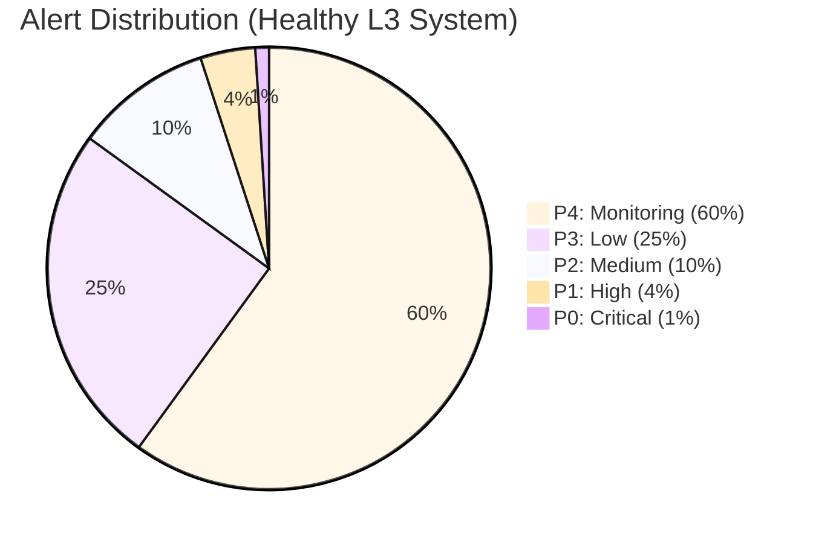

### Alert Severity Distribution (Unhealthy System)

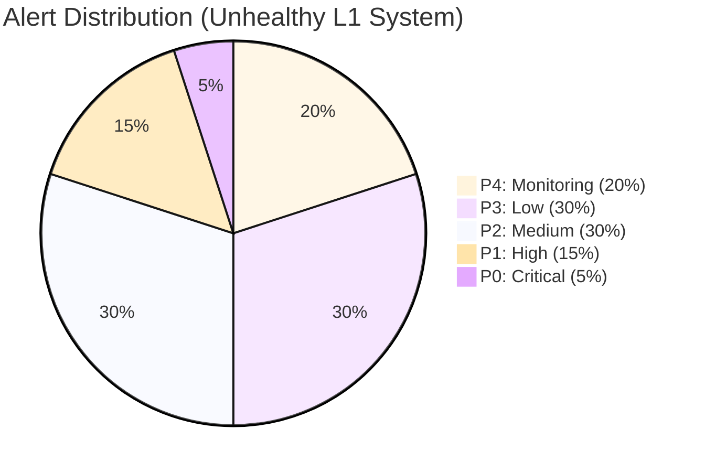

**Key Insight:** If >10% of alerts are P1/P0, your evaluation system needs improvement!

---

## 🏆 Success Benchmarks by Domain

### Healthcare: Quality vs Cost

```mermaid
graph LR
    subgraph Healthcare["🏥 Healthcare Success Profile"]
        Q[Quality Metrics<br/>99.1% Recall<br/>100% Compliance<br/>0 P0 Incidents/Quarter]
        C[Cost Metrics<br/>$2.50/interaction<br/>30% human review<br/>$3.2M annual savings]
        T[Time Metrics<br/>< 1hr hotfix<br/>24/7 monitoring<br/>15min MTTR]
    end
    
    Q --> Success[✅ SUCCESS]
    C --> Success
    T --> Success
    
    style Healthcare fill:#c3f0c3
    style Success fill:#a8e6cf
```

### E-Commerce: Growth vs Efficiency

```mermaid
graph LR
    subgraph Ecommerce["🛒 E-Commerce Success Profile"]
        G[Growth Metrics<br/>+35% conversion<br/>+32% revenue/user<br/>+18% LTV]
        E[Efficiency Metrics<br/>$0.0012/rec<br/>60% cost reduction<br/>380ms p95 latency]
        Q[Quality Metrics<br/>4.2/5 satisfaction<br/>99.8% uptime<br/>2 P1 incidents/quarter]
    end
    
    G --> Success[✅ SUCCESS]
    E --> Success
    Q --> Success
    
    style Ecommerce fill:#c3f0c3
    style Success fill:#a8e6cf
```

### Legal: Risk Mitigation

```mermaid
graph LR
    subgraph Legal["⚖️ Legal Success Profile"]
        R[Risk Metrics<br/>99.1% recall<br/>2 misses/year<br/>18% override rate]
        E[Efficiency Metrics<br/>42% time savings<br/>$280k billable hours<br/>+35% throughput]
        T[Trust Metrics<br/>78% attorney adoption<br/>85% inter-rater agreement<br/>+12% client satisfaction]
    end
    
    R --> Success[✅ SUCCESS]
    E --> Success
    T --> Success
    
    style Legal fill:#c3f0c3
    style Success fill:#a8e6cf
```

### Support: Deflection vs Satisfaction

```mermaid
graph LR
    subgraph Support["💬 Support Success Profile"]
        D[Deflection Metrics<br/>43% ticket deflection<br/>4.2/5 satisfaction<br/>-65% response time]
        C[Cost Metrics<br/>$4.68M savings<br/>$120k AI cost<br/>39x ROI]
        Q[Quality Metrics<br/>4.2/5 across languages<br/>3% tone issues<br/>5% escalation rate]
    end
    
    D --> Success[✅ SUCCESS]
    C --> Success
    Q --> Success
    
    style Support fill:#c3f0c3
    style Success fill:#a8e6cf
```

---

## 🎯 Team Structure by Maturity

### Level 1-2: Startup Mode

```mermaid
graph TD
    subgraph Team["Team Structure (L1-2)"]
        PM[Product Manager<br/>Part-time eval owner]
        Eng1[ML Engineer #1<br/>Metrics + Dataset]
        Eng2[ML Engineer #2<br/>Implementation]
        Domain[Domain Expert<br/>Consulting basis]
    end
    
    PM -.->|Guides| Eng1
    Eng1 <-->|Collaborates| Eng2
    Eng1 -.->|Consults| Domain
    
    style Team fill:#fff4cc
```

**Total Team:** 3.5 FTE  
**Budget:** $150k/year  
**Scale:** <100k interactions/day

---

### Level 3: Growth Mode

```mermaid
graph TD
    subgraph Team["Team Structure (L3)"]
        Lead[Eval Engineering Lead<br/>Strategy + Planning]
        Eng1[Eval Engineer #1<br/>Metrics + Guardrails]
        Eng2[Eval Engineer #2<br/>Monitoring + Ops]
        Eng3[Eval Engineer #3<br/>Dataset + Analysis]
        PM[Product Manager<br/>Prioritization]
        Domain1[Domain Expert #1<br/>20% time]
        Domain2[Domain Expert #2<br/>20% time]
    end
    
    Lead -->|Manages| Eng1
    Lead -->|Manages| Eng2
    Lead -->|Manages| Eng3
    PM -.->|Partners| Lead
    Eng1 -.->|Consults| Domain1
    Eng2 -.->|Consults| Domain2
    
    style Team fill:#c3f0c3
```

**Total Team:** 5.4 FTE  
**Budget:** $400k/year  
**Scale:** 100k-1M interactions/day

---

### Level 4: Platform Mode

```mermaid
graph TD
    subgraph Team["Team Structure (L4)"]
        Dir[Director of AI Quality<br/>Vision + Strategy]
        Lead1[Eval Platform Lead<br/>Infrastructure]
        Lead2[Domain Eval Lead<br/>Product-specific]
        Eng1[Platform Eng #1]
        Eng2[Platform Eng #2]
        Eng3[Platform Eng #3]
        Eng4[Domain Eng #1]
        Eng5[Domain Eng #2]
        PM[Product Manager<br/>Roadmap]
        Researcher[ML Researcher<br/>Advanced methods]
        Domain1[Domain Expert #1<br/>50% time]
        Domain2[Domain Expert #2<br/>50% time]
    end
    
    Dir -->|Leads| Lead1
    Dir -->|Leads| Lead2
    Lead1 -->|Manages| Eng1
    Lead1 -->|Manages| Eng2
    Lead1 -->|Manages| Eng3
    Lead2 -->|Manages| Eng4
    Lead2 -->|Manages| Eng5
    Dir -.->|Partners| PM
    Dir -.->|Collaborates| Researcher
    Lead2 -.->|Consults| Domain1
    Lead2 -.->|Consults| Domain2
    
    style Team fill:#a8e6cf
```

**Total Team:** 12 FTE  
**Budget:** $1M+/year  
**Scale:** 1M+ interactions/day

---

## 📈 Progression Timeline

### Typical Maturity Advancement

```mermaid
gantt
    title Evaluation Maturity Progression (Typical Timeline)
    dateFormat YYYY-MM
    axisFormat %b %Y
    
    section Level 0
    Ad-hoc testing              :l0, 2024-01, 2024-03
    
    section Level 1
    Build reference dataset     :l1a, 2024-03, 2024-04
    Implement basic metrics     :l1b, after l1a, 1M
    Post-mortem process         :l1c, after l1b, 1M
    
    section Level 2
    CI/CD integration           :l2a, 2024-06, 2024-07
    Platform setup              :l2b, after l2a, 1M
    Automated blocking tests    :l2c, after l2b, 1M
    
    section Level 3
    Real-time guardrails        :l3a, 2024-09, 2024-10
    Production monitoring       :l3b, after l3a, 1M
    Alert systems               :l3c, after l3b, 1M
    
    section Level 4
    A/B testing framework       :l4a, 2025-01, 2025-02
    Auto-remediation            :l4b, after l4a, 2M
    Predictive quality          :l4c, after l4b, 2M
```

**Key Milestones:**
- **3 months:** L0 → L1 (Basic evaluation)
- **6 months:** L1 → L2 (Automated validation)
- **9 months:** L2 → L3 (Production monitoring)
- **15 months:** L3 → L4 (Optimization)

**Accelerated Path (Well-funded):** 6-9 months to L3

---

## 🎯 Quick Assessment Tools

### Am I Ready for Level N?

**Level 1 Readiness:**
- [ ] Have you built 20+ reference examples?
- [ ] Do you have basic logging?
- [ ] Have you run post-mortems on incidents?
- **All Yes?** → You're at Level 1 ✓

**Level 2 Readiness:**
- [ ] Does evaluation run automatically in CI/CD?
- [ ] Do you have 100+ reference examples?
- [ ] Do failing tests block deployments?
- **All Yes?** → You're at Level 2 ✓

**Level 3 Readiness:**
- [ ] Do you have real-time guardrails deployed?
- [ ] Is there 24/7 production monitoring?
- [ ] Can you detect issues within 15 minutes?
- **All Yes?** → You're at Level 3 ✓

**Level 4 Readiness:**
- [ ] Do you A/B test all major changes?
- [ ] Is there automated remediation?
- [ ] Do you predict quality issues before they occur?
- **All Yes?** → You're at Level 4 ✓

---

## 🏁 Summary Scorecard

### Domain Quick Reference

| Domain | Safety | Compliance | Cost Focus | Recall > Precision | Human Review | Automation |
|--------|--------|------------|------------|-------------------|--------------|------------|
| 🏥 Healthcare | 🔴 Max | 🔴 Max | 🟢 Low | ✅ Yes | 🔴 Max | 🟢 Low |
| 🛒 E-commerce | 🟢 Low | 🟡 Med | 🔴 High | ❌ No | 🟢 Low | 🔴 Max |
| ⚖️ Legal | 🟠 High | 🔴 Max | 🟡 Med | ✅ Yes | 🔴 Max | 🟡 Med |
| 💬 Support | 🟡 Med | 🟡 Med | 🟡 Med | 🟡 Balanced | 🟡 Med | 🟠 High |

### Metric Approach Quick Reference

| Need | Objective? | Real-time? | Scalable? | → Approach |
|------|------------|------------|-----------|-----------|
| Format validation | ✅ | ✅ | ✅ | 💻 Code-Based |
| Safety filter | ✅ | ✅ | ✅ | 💻 Code-Based |
| Tone evaluation | ❌ | ❌ | ✅ | 🤖 LLM Judge |
| Relevance scoring | ❌ | ❌ | ✅ | 🤖 LLM Judge |
| Legal risk assessment | ❌ | ❌ | ❌ | 👨‍⚖️ Human |
| Medical validation | ❌ | ❌ | ❌ | 👨‍⚖️ Human |

---

**Navigation:** Return to [Main Visual Guide](./AI_EVALS_VISUAL_GUIDE.md)

**Next:** Choose your domain, assess your maturity, and start building! 🚀
