# 🎯 AI Evals: Visual Quick-Start Guide
## Master AI Evaluation in 10 Minutes

> **Navigation:** Use the visual index below to jump to any section

---

## 📑 Visual Table of Contents


---

## 🌟 Part 1: The Big Picture

### The AI Evaluation Universe

```mermaid
graph TB
    subgraph Universe["🌌 AI EVALUATION UNIVERSE"]
        subgraph Why["❓ WHY IT MATTERS"]
            A1[🎲 Non-Deterministic<br/>Same input ≠ Same output]
            A2[⚖️ High Stakes<br/>Money, Safety, Compliance]
            A3[🔍 Black Box<br/>Can't debug like code]
        end
        
        subgraph What["🎯 WHAT TO EVALUATE"]
            B1[📊 Model Capability<br/>Benchmarks, General Skills]
            B2[🎨 Product Quality<br/>Your specific use case]
            B3[👤 User Experience<br/>Actual user satisfaction]
        end
        
        subgraph How["🛠️ HOW TO EVALUATE"]
            C1[💻 Code-Based<br/>Fast, Cheap, Objective]
            C2[🤖 LLM Judge<br/>Scalable, Subjective]
            C3[👨‍⚖️ Human Review<br/>Gold Standard, Expensive]
        end
        
        subgraph When["⏰ WHEN TO EVALUATE"]
            D1[🧪 Pre-Deployment<br/>Reference datasets]
            D2[🚨 Real-Time<br/>Guardrails]
            D3[📈 Continuous<br/>Monitoring & Learning]
        end
    end
    
    Why --> What
    What --> How
    How --> When
    
    style Why fill:#ffe0e0
    style What fill:#e0f0ff
    style How fill:#e0ffe0
    style When fill:#fff0e0
```



### The Core Truth: Traditional vs AI Systems

```mermaid
graph LR
    subgraph Traditional["💻 TRADITIONAL SOFTWARE"]
        T1[Deterministic<br/>x → y always]
        T2[Unit Tests<br/>Pass/Fail]
        T3[Ship It!<br/>High confidence]
    end
    
    subgraph AI["🤖 AI SYSTEMS"]
        A1[Non-Deterministic<br/>x → y, z, w...]
        A2[Probabilistic Tests<br/>% success rate]
        A3[Monitor Forever<br/>Continuous validation]
    end
    
    T1 -.X.-> A1
    T2 -.X.-> A2
    T3 -.X.-> A3
    
    style Traditional fill:#c3f0c3
    style AI fill:#ffcccc
```



---

## 📊 Part 2: Evaluation Maturity Spectrum

### The 5-Level Journey

```mermaid
journey
    title Evaluation Maturity Journey
    section Level 0: Ad-Hoc
      Manual testing: 1: Team
      Random checks: 1: Team
      No process: 1: Team
    section Level 1: Reactive
      Reference dataset: 3: Team
      Basic logging: 3: Team
      Post-mortems: 2: Team
    section Level 2: Proactive
      Automated tests: 5: Team
      CI/CD integration: 5: Team
      Blocking tests: 4: Team
    section Level 3: Continuous
      Real-time guardrails: 7: Team
      Production monitoring: 7: Team
      Alert systems: 6: Team
    section Level 4: Optimizing
      A/B testing: 9: Team
      Auto-remediation: 9: Team
      Predictive quality: 8: Team
```

### Maturity Level Comparison

| Level | Time to Deploy Fix | Cost | Team Size | ROI | Risk |
|-------|-------------------|------|-----------|-----|------|
| 🔴 **L0: Ad-Hoc** | Days | 💰 | 1-5 | ❌ Negative | 🔥🔥🔥🔥🔥 |
| 🟠 **L1: Reactive** | Hours | 💰💰 | 5-10 | ⚠️ Break-even | 🔥🔥🔥 |
| 🟡 **L2: Proactive** | Hours | 💰💰💰 | 10-20 | ✅ 100%+ | 🔥🔥 |
| 🟢 **L3: Continuous** | Minutes | 💰💰💰💰 | 20-50 | ✅ 200%+ | 🔥 |
| 🔵 **L4: Optimizing** | Seconds | 💰💰💰💰💰 | 50+ | ✅ 300%+ | ✨ |

---

## 🎭 Part 3: Domain Scenarios at a Glance

### Four Worlds of AI Evaluation


### Domain Comparison Dashboard

```mermaid
graph TD
    subgraph Domains["🌍 DOMAIN COMPARISON"]
        subgraph Healthcare["🏥 HEALTHCARE"]
            H1[Stakes: 🔴 CRITICAL]
            H2[Recall: 99%+]
            H3[Cost/Call: $$]
            H4[Review: 100%]
        end
        
        subgraph Ecommerce["🛒 E-COMMERCE"]
            E1[Stakes: 🟡 REVENUE]
            E2[Precision: 70%+]
            E3[Cost/Call: $]
            E4[Review: 1%]
        end
        
        subgraph Legal["⚖️ LEGAL"]
            L1[Stakes: 🔴 LIABILITY]
            L2[Recall: 99%+]
            L3[Cost/Call: $$$]
            L4[Review: 50%]
        end
        
        subgraph Support["💬 SUPPORT"]
            S1[Stakes: 🟢 SATISFACTION]
            S2[Deflection: 40%+]
            S3[Cost/Call: $]
            S4[Review: 5%]
        end
    end
    
    style Healthcare fill:#ffcccc
    style Ecommerce fill:#fff4cc
    style Legal fill:#ffe0cc
    style Support fill:#c3f0c3
```



### Domain-Specific Metric Priorities


---

## 🔄 Part 4: The Complete Evaluation Lifecycle

### End-to-End Flow

```mermaid
flowchart TD
    Start([💡 AI Product Idea]) --> Decide{Need AI?}
    Decide -->|No| Traditional[💻 Traditional Dev]
    Decide -->|Yes| Model[📊 Model Selection]
    
    Model --> Dataset[📝 Build Reference Dataset<br/>10-50 examples]
    Dataset --> Metrics[📏 Design Metrics<br/>Code/LLM/Human]
    Metrics --> Implement[⚙️ Implement Evaluation]
    
    Implement --> Validate{Pre-Deploy<br/>Validation}
    Validate -->|Fail| Fix[🔧 Iterate<br/>Prompts/Data/Model]
    Fix --> Validate
    
    Validate -->|Pass| Deploy[🚀 Deploy 10% Traffic]
    
    Deploy --> Monitor{Production<br/>Quality OK?}
    Monitor -->|P0 Issue| Incident[🚨 INCIDENT<br/>Rollback <30min]
    Monitor -->|P1 Issue| Throttle[⚠️ Throttle Traffic]
    Monitor -->|OK| Scale[📈 Scale to 100%]
    
    Incident --> RCA[🔍 Root Cause]
    Throttle --> RCA
    RCA --> Fix
    
    Scale --> Continuous[🔄 Continuous Monitoring]
    Continuous --> Discover{New Pattern?}
    Discover -->|Yes| Dataset
    Discover -->|No| Continuous
    
    style Start fill:#e1f5ff
    style Deploy fill:#c3f0c3
    style Incident fill:#ffcccc
    style Scale fill:#a8e6cf
    style Continuous fill:#fff4cc
```



---

## 🎯 Part 5: Metric Selection Strategy

### The Metric Decision Tree

```mermaid
flowchart TD
    Q1{Is it<br/>Objective?}
    Q1 -->|Yes| Q2{Real-time<br/>needed?}
    Q1 -->|No| Q3{Can define<br/>rubric?}
    
    Q2 -->|Yes| Code1[✅ CODE-BASED<br/>ONLINE GUARDRAIL]
    Q2 -->|No| Code2[✅ CODE-BASED<br/>OFFLINE BATCH]
    
    Q3 -->|No| Human1[✅ HUMAN ONLY<br/>Expert judgment]
    Q3 -->|Yes| Q4{Budget for<br/>scale?}
    
    Q4 -->|No| Human2[⚠️ HUMAN SAMPLE<br/>+ Skip some]
    Q4 -->|Yes| Q5{Can calibrate<br/>LLM judge?}
    
    Q5 -->|Yes| LLM1[✅ LLM JUDGE<br/>Calibrated]
    Q5 -->|No| Q6{Critical<br/>metric?}
    
    Q6 -->|Yes| Build[🔨 Build human<br/>labels first]
    Q6 -->|No| Skip[❌ Skip metric<br/>or redefine]
    
    Build --> LLM1
    
    style Code1 fill:#c3f0c3
    style Code2 fill:#c3f0c3
    style LLM1 fill:#ffe0cc
    style Human1 fill:#fff4cc
    style Human2 fill:#fff4cc
    style Skip fill:#ffcccc
```



### Metric Approach Comparison

```mermaid
graph LR
    subgraph Comparison["📊 METRIC APPROACH COMPARISON"]
        subgraph Code["💻 CODE-BASED"]
            C1[Cost: $]
            C2[Speed: <10ms]
            C3[Best: Objective rules]
            C4[Example: Format check]
        end
        
        subgraph LLM["🤖 LLM JUDGE"]
            L1[Cost: $$]
            L2[Speed: 500ms-2s]
            L3[Best: Subjective quality]
            L4[Example: Tone eval]
        end
        
        subgraph Human["👨‍⚖️ HUMAN"]
            H1[Cost: $$$]
            H2[Speed: Minutes]
            H3[Best: Nuanced judgment]
            H4[Example: Legal risk]
        end
    end
    
    Code -->|Scale up| LLM
    LLM -->|Higher stakes| Human
    
    style Code fill:#c3f0c3
    style LLM fill:#fff4cc
    style Human fill:#ffe0cc
```



---

## 🚨 Part 6: Incident Response Framework

### Severity Assessment Flow


### Response Time & Cost by Severity


---

## 💰 Part 7: ROI & Cost Analysis

### Investment vs Return by Maturity Level

```mermaid
graph TD
    subgraph ROI["💰 EVALUATION ROI PROGRESSION"]
        L0[Level 0: Ad-Hoc<br/>Investment: $0<br/>Cost of Incidents: -$500k<br/>ROI: -∞%]
        L1[Level 1: Reactive<br/>Investment: $50k<br/>Incidents Prevented: $200k<br/>ROI: 300%]
        L2[Level 2: Proactive<br/>Investment: $150k<br/>Incidents Prevented: $600k<br/>ROI: 300%]
        L3[Level 3: Continuous<br/>Investment: $400k<br/>Value Generated: $1.5M<br/>ROI: 275%]
        L4[Level 4: Optimizing<br/>Investment: $1M<br/>Value Generated: $4M<br/>ROI: 300%]
    end
    
    L0 -->|+$50k| L1
    L1 -->|+$100k| L2
    L2 -->|+$250k| L3
    L3 -->|+$600k| L4
    
    style L0 fill:#ffcccc
    style L1 fill:#ffe0cc
    style L2 fill:#fff4cc
    style L3 fill:#c3f0c3
    style L4 fill:#a8e6cf
```



### Cost Breakdown by Component


---

## 🏗️ Part 8: Build vs Buy Decision

### Platform Selection Matrix

```mermaid
flowchart TD
    Start([Need Evaluation<br/>Platform]) --> Volume{Daily<br/>Volume?}
    
    Volume -->|<1k| Small[Small Scale Path]
    Volume -->|1k-100k| Medium[Medium Scale Path]
    Volume -->|>100k| Large[Large Scale Path]
    
    Small --> Budget1{Budget?}
    Budget1 -->|<$500/mo| OSS1[✅ Open Source<br/>Langfuse Community]
    Budget1 -->|>$500/mo| Managed1[✅ Managed Lite<br/>Weave/Helicone]
    
    Medium --> Compliance{HIPAA/SOC2?}
    Compliance -->|Yes| SelfHost[✅ Self-Hosted<br/>Langfuse/Custom]
    Compliance -->|No| Budget2{Budget?}
    
    Budget2 -->|<$2k/mo| OSS2[✅ OSS + Cloud<br/>Langfuse Cloud]
    Budget2 -->|$2-10k/mo| Managed2[✅ Managed Platform<br/>Arize/Humanloop]
    Budget2 -->|>$10k/mo| Consider[🤔 Consider Custom]
    
    Large --> Unique{Unique<br/>Needs?}
    Unique -->|Yes| Custom[✅ Custom Build<br/>Internal Platform]
    Unique -->|No| Enterprise[✅ Enterprise<br/>Arize Enterprise]
    
    style OSS1 fill:#c3f0c3
    style OSS2 fill:#c3f0c3
    style Managed1 fill:#fff4cc
    style Managed2 fill:#ffe0cc
    style Enterprise fill:#ffcccc
    style Custom fill:#e0e0e0
```



### Platform Comparison

| Feature | OSS (Free) | OSS Cloud | Managed | Enterprise | Custom |
|---------|------------|-----------|---------|------------|--------|
| **Cost** | $0 + infra | $500-2k/mo | $2-10k/mo | $10k+/mo | Eng salary |
| **Setup** | 1 week | 1 day | Hours | Hours | 3-6 months |
| **Control** | ⭐⭐⭐⭐⭐ | ⭐⭐⭐⭐ | ⭐⭐⭐ | ⭐⭐⭐ | ⭐⭐⭐⭐⭐ |
| **Support** | Community | Email | Slack | Dedicated | Internal |
| **Scale** | <10k/day | <100k/day | <1M/day | Unlimited | Unlimited |

---

## 🔬 Part 9: Specialized Evaluation Patterns

### RAG System Evaluation

```mermaid
flowchart LR
    Query[User Query] --> Retrieval[🔍 Retrieval]
    Retrieval --> Docs[Retrieved Docs]
    
    Docs --> EvalR{Eval<br/>Retrieval}
    EvalR --> R1[Precision@K]
    EvalR --> R2[Recall@K]
    EvalR --> R3[Relevance]
    
    Docs --> Generation[🤖 Generation]
    Generation --> Answer[Generated Answer]
    
    Answer --> EvalG{Eval<br/>Generation}
    EvalG --> G1[Faithfulness]
    EvalG --> G2[Completeness]
    EvalG --> G3[Correctness]
    
    R1 --> Score[📊 Combined<br/>Quality Score]
    R2 --> Score
    R3 --> Score
    G1 --> Score
    G2 --> Score
    G3 --> Score
    
    style EvalR fill:#fff4cc
    style EvalG fill:#ffe0cc
    style Score fill:#c3f0c3
```

### Multi-Turn Conversation Evaluation

```mermaid
sequenceDiagram
    participant U as 👤 User
    participant A as 🤖 AI
    participant E as 📊 Evaluator
    
    Note over U,E: Turn 1
    U->>A: Initial query
    A->>U: Response 1
    activate E
    E->>E: ✓ Relevance<br/>✓ Tone
    deactivate E
    
    Note over U,E: Turn 2
    U->>A: Follow-up
    A->>U: Response 2
    activate E
    E->>E: ✓ Context retention<br/>✓ Consistency
    deactivate E
    
    Note over U,E: Turn 3
    U->>A: Clarification
    A->>U: Response 3
    activate E
    E->>E: ✓ Coherence
    deactivate E
    
    Note over E: Session Metrics
    E->>E: ✓ Goal completion<br/>✓ Escalation timing<br/>✓ Satisfaction proxy
```

---

## 🌍 Part 10: Multi-Lingual & Cultural Evaluation

### Cultural Complexity Spectrum

```mermaid
graph LR
    subgraph Cultural["🌍 CULTURAL EVALUATION COMPLEXITY"]
        L1[🇺🇸 English Only<br/>Complexity: ⭐]
        L2[🌐 Multi-Language<br/>Direct Translation<br/>Complexity: ⭐⭐]
        L3[🗺️ Regional Variants<br/>ES vs LATAM<br/>Complexity: ⭐⭐⭐]
        L4[🎭 Cultural Nuance<br/>Formality/Tone<br/>Complexity: ⭐⭐⭐⭐]
        L5[🔀 Code-Switching<br/>Mixed Languages<br/>Complexity: ⭐⭐⭐⭐⭐]
    end
    
    L1 --> L2 --> L3 --> L4 --> L5
    
    style L1 fill:#c3f0c3
    style L2 fill:#e0f0c3
    style L3 fill:#fff4cc
    style L4 fill:#ffe0cc
    style L5 fill:#ffcccc
```

### Language-Specific Tone Rubrics

```mermaid
graph TD
    subgraph Tones["🗣️ TONE EXPECTATIONS BY CULTURE"]
        EN[🇺🇸 English<br/>Friendly but professional<br/>Balance warmth + efficiency]
        DE[🇩🇪 German<br/>Direct and efficient<br/>Minimal small talk]
        FR[🇫🇷 French<br/>Polite and respectful<br/>Formal until invited]
        ES[🇪🇸 Spanish (Spain)<br/>Polite and formal<br/>Professional distance]
        LATAM[🌎 Spanish (LATAM)<br/>Warm and personal<br/>Relationship-focused]
    end
    
    style EN fill:#e1f5ff
    style DE fill:#ffe0e0
    style FR fill:#e0e0ff
    style ES fill:#fff4cc
    style LATAM fill:#ffe0cc
```

---

## 📈 Part 11: Success Metrics Dashboard

### Business Impact by Domain

| Domain | Key Metric | Before AI | After AI | Improvement |
|--------|-----------|-----------|----------|-------------|
| 🏥 **Healthcare** | ER Visit Reduction | Baseline | -22% | $3.2M saved |
| 🛒 **E-Commerce** | Conversion Rate | 2.3% | 3.1% | +35% |
| ⚖️ **Legal** | Review Time | 100% | 58% | 42% faster |
| 💬 **Support** | Ticket Deflection | 0% | 43% | $4.68M saved |

### Evaluation Evolution Timeline

```mermaid
gantt
    title Typical Evaluation System Evolution
    dateFormat YYYY-MM
    axisFormat %b
    
    section Reference Data
    Initial dataset (20)           :2024-01, 2024-01
    Expand to 100                  :2024-02, 2024-03
    Expand to 500                  :2024-06, 2024-09
    Continuous expansion           :2024-09, 2024-12
    
    section Metrics
    Basic metrics (3)              :2024-01, 2024-02
    Add LLM judges (6)             :2024-02, 2024-04
    Domain-specific (10)           :2024-04, 2024-07
    Optimized suite (12)           :2024-07, 2024-12
    
    section Infrastructure
    Manual evaluation              :2024-01, 2024-02
    Basic automation               :2024-02, 2024-04
    CI/CD integration              :2024-04, 2024-06
    Real-time monitoring           :2024-06, 2024-12
```

---

## 🎓 Part 12: Learning Path Navigator

### Choose Your Journey

```mermaid
flowchart TD
    You([Who Are You?]) --> Role{Your Role?}
    
    Role -->|Engineer| Exp1{Experience?}
    Role -->|PM/Designer| PM[📱 PM PATH]
    Role -->|Executive| Exec[📊 EXEC PATH]
    Role -->|Domain Expert| Expert[🎯 EXPERT PATH]
    
    Exp1 -->|New to AI| New[🌱 BEGINNER PATH]
    Exp1 -->|Building Now| Build[🚀 BUILDER PATH]
    Exp1 -->|In Production| Prod[⚙️ PRODUCTION PATH]
    
    New --> N1[1️⃣ Why Evals Matter<br/>2️⃣ Healthcare Scenario<br/>3️⃣ Maturity Assessment<br/>4️⃣ Build First Dataset]
    
    Build --> B1[1️⃣ Choose Domain Scenario<br/>2️⃣ Metric Selection Flow<br/>3️⃣ ROI Calculator<br/>4️⃣ Platform Decision]
    
    Prod --> P1[1️⃣ Maturity Assessment<br/>2️⃣ Incident Response<br/>3️⃣ Optimization Patterns<br/>4️⃣ Advanced Monitoring]
    
    PM --> PM1[1️⃣ Big Picture<br/>2️⃣ Domain Comparison<br/>3️⃣ ROI Analysis<br/>4️⃣ Stakeholder Alignment]
    
    Exec --> E1[1️⃣ Business Impact<br/>2️⃣ Risk Framework<br/>3️⃣ Investment ROI<br/>4️⃣ Maturity Model]
    
    Expert --> Ex1[1️⃣ Domain Scenario Match<br/>2️⃣ Rubric Design<br/>3️⃣ Human Review Setup<br/>4️⃣ LLM Calibration]
    
    style New fill:#c3f0c3
    style Build fill:#fff4cc
    style Prod fill:#ffe0cc
    style PM fill:#e1f5ff
    style Exec fill:#e0e0ff
    style Expert fill:#ffe0e0
```

---

## 🗺️ Part 13: Quick Reference Map

### The Evaluation Canvas

```mermaid
mindmap
  root((AI EVALS<br/>Master Map))
    Pre-Deploy
      Reference Dataset
        Start: 10-20 examples
        Expand: Domain experts
        Iterate: Production learnings
      Metrics
        Code: Objective rules
        LLM: Subjective quality
        Human: Gold standard
      Validation
        Pass threshold
        Iterate prompts
        Test edge cases
    
    Production
      Guardrails
        P0: Safety/Legal
        Real-time checks
        Auto-response
      Monitoring
        Offline analysis
        Trend detection
        User signals
      Incidents
        Severity assessment
        Response SLA
        Post-mortem
    
    Optimization
      ROI Tracking
        Cost per metric
        Value generated
        Break-even point
      A/B Testing
        Metric comparison
        User satisfaction
        Business impact
      Maturity
        Level 0 → 4
        Quarterly assessment
        Gap analysis
    
    Domains
      Healthcare
        Safety first
        100% logging
        Human-in-loop
      E-commerce
        Revenue focus
        A/B testing
        Diversity balance
      Legal
        High recall
        Transparency
        Attorney calibration
      Support
        Cultural nuance
        Regional variants
        Deflection rate
```

---

## ⚡ Part 14: Power Tips & Pitfalls

### Top 10 Evaluation Anti-Patterns

```mermaid
graph TD
    subgraph AntiPatterns["❌ AVOID THESE MISTAKES"]
        AP1[🎯 Benchmarks predict<br/>product success]
        AP2[🤖 LLM judges work<br/>without calibration]
        AP3[📊 More metrics =<br/>Better evaluation]
        AP4[✅ One-time setup<br/>before launch]
        AP5[👨‍💻 Engineers alone<br/>can design evals]
        AP6[🔍 Offline eval =<br/>Online performance]
        AP7[💯 Comprehensive coverage<br/>from day one]
        AP8[🚨 Online for everything]
        AP9[📈 Same metrics for<br/>all domains]
        AP10[🎓 Skip human review]
    end
    
    style AntiPatterns fill:#ffcccc
```

### Top 10 Evaluation Best Practices

```mermaid
graph TD
    subgraph BestPractices["✅ FOLLOW THESE PRINCIPLES"]
        BP1[🎯 Product evals > Model evals]
        BP2[🤝 Involve domain experts early]
        BP3[📊 Start small, iterate fast]
        BP4[⚖️ Context determines priorities]
        BP5[🔄 Continuous evolution]
        BP6[💰 Measure ROI regularly]
        BP7[🚨 Guardrails for critical behaviors]
        BP8[📈 A/B test major changes]
        BP9[👥 Human-in-loop for high stakes]
        BP10[📚 Learn from production]
    end
    
    style BestPractices fill:#c3f0c3
```

---

## 🎯 Part 15: Action Checklist

### Your Next 30 Days

```mermaid
gantt
    title Your First Month of AI Evaluation
    dateFormat YYYY-MM-DD
    axisFormat %b %d
    
    section Week 1: Assess
    Maturity self-assessment              :w1a, 2024-01-01, 1d
    Choose domain scenario                :w1b, after w1a, 1d
    Identify stakeholders                 :w1c, after w1b, 1d
    
    section Week 2: Plan
    Build vs buy decision                 :w2a, after w1c, 2d
    ROI calculator for metrics            :w2b, after w2a, 2d
    Create gap analysis                   :w2c, after w2b, 1d
    
    section Week 3: Build
    Create reference dataset (20)         :w3a, after w2c, 3d
    Implement 2 code-based guardrails     :w3b, after w3a, 3d
    
    section Week 4: Deploy
    Set up logging                        :w4a, after w3b, 2d
    Create incident runbook               :w4b, after w4a, 2d
    Launch pilot (10%)                    :w4c, after w4b, 2d
```

### Essential Checklist

**Week 1: Foundation** ⏰ 5-8 hours
- [ ] Complete maturity assessment (30 min)
- [ ] Read relevant domain scenario (2 hours)
- [ ] Identify 3-5 critical failure modes (1 hour)
- [ ] Map team roles (PM, domain expert, engineer) (1 hour)

**Week 2: Strategy** ⏰ 8-10 hours
- [ ] Use build vs buy flowchart (1 hour)
- [ ] Calculate ROI for top 3 metrics (2 hours)
- [ ] Create 90-day roadmap (2 hours)
- [ ] Set up evaluation tools (3 hours)

**Week 3: Build** ⏰ 15-20 hours
- [ ] Create 10-20 reference examples (5 hours)
- [ ] Implement 2 code-based checks (4 hours)
- [ ] Set up basic logging (3 hours)
- [ ] Draft incident response plan (2 hours)

**Week 4: Launch** ⏰ 10-15 hours
- [ ] Validate on reference dataset (3 hours)
- [ ] Set up monitoring dashboard (3 hours)
- [ ] Train team on incident response (2 hours)
- [ ] Deploy to 10% traffic (2 hours)

---

## 🏆 Part 16: Success Metrics

### How to Know You're Succeeding

```mermaid
graph TD
    subgraph Success["✅ SUCCESS INDICATORS"]
        subgraph Technical["💻 Technical Health"]
            T1[Incident MTTR ↓]
            T2[Test coverage ↑]
            T3[False positive rate ↓]
        end
        
        subgraph Business["💰 Business Impact"]
            B1[Revenue/Cost savings]
            B2[User satisfaction ↑]
            B3[Time to market ↓]
        end
        
        subgraph Team["👥 Team Capability"]
            Te1[Shared vocabulary]
            Te2[Faster decisions]
            Te3[Knowledge retention]
        end
        
        subgraph Maturity["📈 System Maturity"]
            M1[Level advancement]
            M2[Automation %]
            M3[Proactive vs reactive]
        end
    end
    
    Technical --> ROI[📊 Positive ROI]
    Business --> ROI
    Team --> ROI
    Maturity --> ROI
    
    style Success fill:#c3f0c3
    style ROI fill:#a8e6cf
```

### Target Metrics by Maturity Level

| Metric | L1: Reactive | L2: Proactive | L3: Continuous | L4: Optimizing |
|--------|-------------|---------------|----------------|----------------|
| **MTTR** | < 4 hours | < 1 hour | < 15 min | < 5 min |
| **Eval Coverage** | 30% | 60% | 85% | 95% |
| **Automation** | 20% | 60% | 85% | 95% |
| **Cost Efficiency** | Baseline | 2x | 3x | 5x |
| **ROI** | 100% | 200% | 300% | 400% |

---

## 🎬 Conclusion: Your Evaluation Journey Starts Now

```mermaid
flowchart LR
    Start([🎯 You Are Here]) --> Assess[📊 Assess<br/>Your Maturity]
    Assess --> Learn[📚 Learn from<br/>Domain Scenarios]
    Learn --> Plan[🗺️ Create Your<br/>Roadmap]
    Plan --> Build[🔨 Build Your<br/>System]
    Build --> Deploy[🚀 Deploy with<br/>Confidence]
    Deploy --> Optimize[📈 Optimize<br/>Continuously]
    
    Optimize -.->|Never stops| Learn
    
    style Start fill:#e1f5ff
    style Deploy fill:#c3f0c3
    style Optimize fill:#a8e6cf
```

### Remember These Core Truths

> 💡 **AI systems are non-deterministic** - Embrace probabilistic thinking

> 🎯 **Context is everything** - Healthcare ≠ E-commerce ≠ Legal

> 🔄 **Evaluation is continuous** - Not a one-time setup

> 💰 **ROI is measurable** - Track value, not just costs

> 👥 **Teams > Tools** - Domain experts are irreplaceable

> 📈 **Start small, iterate** - 10 examples beats analysis paralysis

> 🚨 **Prepare for incidents** - They will happen, be ready

---

## 🗺️ Navigation Summary

**Quick Jumps:**
- 🌟 [The Big Picture](#-part-1-the-big-picture) - Why AI evaluation matters
- 📊 [Maturity Spectrum](#-part-2-evaluation-maturity-spectrum) - Where are you?
- 🎭 [Domain Scenarios](#-part-3-domain-scenarios-at-a-glance) - Learn from others
- 🔄 [Complete Lifecycle](#-part-4-the-complete-evaluation-lifecycle) - End-to-end flow
- 🎯 [Metric Selection](#-part-5-metric-selection-strategy) - Choose wisely
- 🚨 [Incident Response](#-part-6-incident-response-framework) - Be prepared
- 💰 [ROI Analysis](#-part-7-roi--cost-analysis) - Justify investment
- 🏗️ [Build vs Buy](#-part-8-build-vs-buy-decision) - Platform selection
- 🔬 [Specialized Patterns](#-part-9-specialized-evaluation-patterns) - RAG, conversations
- 🌍 [Multi-Lingual](#-part-10-multi-lingual--cultural-evaluation) - Cultural nuance
- 📈 [Success Metrics](#-part-11-success-metrics-dashboard) - Business impact
- 🎓 [Learning Paths](#-part-12-learning-path-navigator) - Choose your journey
- ⚡ [Power Tips](#-part-14-power-tips--pitfalls) - Dos and don'ts
- 🎯 [Action Checklist](#-part-15-action-checklist) - Next 30 days

---

**⏱️ Time Invested:** 10 minutes  
**📚 Knowledge Gained:** Complete AI evaluation framework  
**🚀 Ready to:** Build production-ready evaluation systems  

**Next Step:** Choose your learning path and dive deeper into specific areas! 🎉
